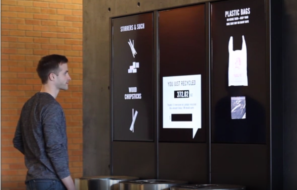

# 绪论

## 背景及意义

生态环境与每个人都息息相关，它的好坏将不仅仅关乎动植物的生存，也会直接或间接地影响人类的身体健康[@kumar2016]。习近平总书记在党的十九大报告中指出：绿水青山就是金山银山，更是揭示了生态环境对于人类生产生活的重要关系。

随着经济的发展和人们生活水平的日益提高，人们对于工业产品的依赖也日益增强。为了满足人们的生活需要，大量的工厂开动，将自然资源生产成为各种商品。大规模的生产和大量的消费不仅消耗了自然资源，还产生了大量的废弃物，这些废弃物如不得到妥善的处理，势必对生态环境造成伤害。因此，垃圾回收处理是十分必要的，不仅能保护生态环境免遭破坏，让我们的生活环境更加美好，也实现了资源的再生利用，减少了自然资源的使用。
世界许多发达国家已经在几十年前实施了垃圾分类回收制度，且取得了明显的效果。中国政府自2002年起开始鼓励垃圾分类，但是未取得明显成果。2019年1月31日，上海市第十五届人大二次会议表决通过《上海市生活垃圾管理条例》，《条例》规定居民生活垃圾需分类投放。同时，北京，西安，南京[@xinhua_nj]等多个城市均出台新政策鼓励居民积极参与垃圾分类回收，新华网称：中国垃圾分类进入了强制时代[@zotero-84]。

不难看出，中国积极实施垃圾分类回收政策，履行维护生态环境塑造“绿水青山”的义务。然而政策发布之后实际实施的效果如何？上海市于2019年通过《上海市生活垃圾管理条例》开启了强制分类时代，实际上，自2011年起，上海市政府就不断在城市生活垃圾处理方面投入资金和人力资源。自2011年至2017年间，上海市生活垃圾收集点由30648处增长到32247处；废物箱由78213只增长到86246只[@ShangHaiShiTongJiJu2020]。然而有调查指出，上海市的垃圾分类仍存在部分问题，如分类细则逻辑较弱，让人难以理解和分辨[@WangYao2020]；社会群体对于垃圾分类政策的接受度与积极性不强[@WangYao2020; @Dong2019]；基础设施设备问题较多[@Dong2019]等。北京，西安，南京等城市的垃圾分类也存在类似的情况，如文献[@huhao2020]指出，虽然超过九成的受访者表示了解相关政策与标准，但是只有约半数的受访者可以做到详细的生活垃圾分类；长安大学的一项调查研究[@Jiang2021]指出：西安作为垃圾分类试点城市，虽然政府积极响应号召，但是由于法规不完善、基础设施不足以及缺乏财政支持和宣传不足等原因，垃圾分类政策并未落到实处；在南京，垃圾分类政策的落实也依然存在居民自觉性与积极性不足、设施与标准不统一等问题[@zhaoyiru2021]。

综上所述，虽然我国各级政府都积极响应垃圾分类回收政策，但其效果却并不尽如人意。究其原因，许多城市都有如下两个问题：1. 垃圾分类设施不完备，居民无法进行垃圾分类；2. 缺乏垃圾分类激励政策，居民垃圾分类积极性不高。针对以上问题，本设计开发了一套用于城市社区垃圾回收点的城市智能物联网垃圾桶系统，实现了垃圾回收站点垃圾桶的状态实时监控和居民垃圾分类积分激励系统，解决了垃圾分类设备设施不合理和居民对垃圾分类的积极性不高的问题。同时，本系统的垃圾量监控功能还可以提高城市生活垃圾的清理和回收效率，具有巨大的社会和经济效益。

## 国内外研究现状

### 国内研究现状

中国自封建时代就十分注重城市街道的干净整洁，《韩非子·内储说》记载殷商时期法律：殷之法，弃灰于道者断其手。灰即垃圾，在街道上丢弃垃圾将受到断手的刑法足以见其对此的重视。然而，直到上世纪七八十年代，我国才出现了替代“土坑”部分作用的简易垃圾桶，如图1所示{@fig:trashbinInOldTimes}图为竹编垃圾桶，(b)图为“土坑”垃圾桶。

{#fig:trashbinInOldTimes width=14cm height=6cm}

本世纪初期出现的简单分类垃圾桶，让我国人民开始得知垃圾分类的重要意义。分类垃圾桶由传统的一桶变化为多桶一体，并且可回收垃圾桶中收集的有价值可再利用的垃圾可以循环利用，减少了资源的浪费；有害垃圾桶内收集的废旧电池，部分含有重金属元素的电子垃圾，更是有效减少了危险有毒物质对于环境的破坏。近年来垃圾桶逐渐向着多功能，智能化发展。

如安装有太阳能电池和压缩机的CleanCUBE垃圾桶，其可通过太阳能电池提供的电力驱动压缩机压缩垃圾，使它可以吃下比一般垃圾桶多8倍的垃圾，如图{@fig:CleanCUBETrashBin}所示是CleanCUBE垃圾桶示意图；还有研究团队将传感器技术与压缩机共同用于垃圾桶，设计开发出了可以自主压缩、满溢提醒的智能垃圾桶[@Jin2010]，该垃圾桶还具有自动打包装袋垃圾的功能，方便使用的同时避免了人与垃圾的直接接触，十分卫生。压缩式的垃圾桶可以提高垃圾桶垃圾储量，减少工作人员清理的次数。但是压缩垃圾所需的电能较多，一般城市垃圾桶布置的位置恐无法提供足够的电功率，太阳能电池又无法解决背阴处以及阴雨天气的使用，因此该类型的垃圾桶并不适合城市大规模部署使用。

{#fig:CleanCUBETrashBin width=14cm}

还有研究团队结合嵌入式技术和语音识别技术，开发出具有语音识别功能的智能垃圾桶，这类垃圾桶具有能够根据使用者的语音指令做出反应的能力。如根据人的指令移动到指定位置[@Su2019]、开启桶盖[@Zhang2017]以及结合深度学习技术和机器视觉技术设计的可以根据使用者念出垃圾类型进行智能分类的智能垃圾桶[@Guo2020; @Xie2018]。这些智能化的垃圾桶虽然具有较高级的功能，但是其使用性不足，如根据语音指令移动和开盖功能并非必要；基于语音或机器视觉的智能分类技术只能根据用户主动提供语音或图像信息才能实现分类。但是在城市社区的垃圾投递场景下，用户的垃圾一般被包裹在深色垃圾袋中，无法提供视觉信息；垃圾袋中垃圾较多时，提供垃圾类型语音信息也会占用使用者大量的时间，并不方便。

更有研究者另辟蹊径，设计研发出了基于机器视觉的自动垃圾分类分拣机器人系统[@chenzhihong2017]。这种机器人系统基于机器视觉技术和机器人技术，采用深度学习方法实现对复杂背景下垃圾对象的识别和定位，同时采用机械手进行垃圾的抓取和分拣。这一系统可以用于垃圾分拣中心，在垃圾分拣流水线上进行垃圾的自动化分拣。但是垃圾分拣有较多限制，如许多不易抓取的垃圾，就无法通过机器分拣实现分类。要从源头解决生活垃圾分类回收的问题，必须从智能化的垃圾桶入手。

### 国外研究现状

由于经济社会发展的不同，许多发达国家在垃圾分类方面走在我国前面。例如在德国、美国和日本，垃圾分类被立法支持，在比利时、罗马、奥地利等国，未分类的垃圾会被垃圾回收公司拒收且警告。在这些垃圾分类执行较好的国家，垃圾桶的发展自然也走在前列。

法国的初创公司Smartup Cities开发的基于超声波传感器的垃圾桶内部填充水平的监测解决方案。可以将它安装在现有的垃圾桶上[@Filarski2020]，实现对垃圾桶内部垃圾量的远程监控，而且可以根据垃圾桶内垃圾量数据为城市管理部门规划最优的垃圾收集路线，图{@fig:SmartupCities}所示即使该产品安装在普通现有垃圾桶上。无独有偶，捷克斯洛伐克的Sensoneo公司也开发了一种垃圾桶容量的监测系统。不同的是，Sensoneo公司开发的系统可以适配多种传感器。并且具有更加复杂的软件服务，如数据智能分析，智能路线规划和垃圾信息管理系统等。除垃圾量监测外，总部位于澳大利亚的Smartsensor公司开发了一种利用温度传感器监测垃圾桶内温度的系统，该系统可以根据客户的需求制定一个警告阈值，当有垃圾桶内的温度超过该阈值时，系统可以通过短信或Email的形式通知管理人员。美国的EvoEco公司则更注重垃圾桶的人机交互系统，这家公司开发的EvoBin系统配备了屏幕、数据看板和其他交互系统，以吸引用户的注意力。例如，EvoBin的人机交互系统可以用电子游戏的元素来教育用户如何正确地进行垃圾分类，或者在用户丢弃垃圾后通过内置的传感器感测垃圾类型，并通过屏幕显式垃圾信息与用户交互，如图{@fig:EvoEco}所示。通过激发用户兴趣的方式达到自己的设计目的，不失为优秀的公共设施设计[@Li2012]。

{#fig:SmartupCities width=11.35cm}

{#fig:EvoEco width=14cm}

除工业企业外，也有大学和研究机构进行智能垃圾桶方向的探索。如印度印度拉贾斯坦邦NIIT大学计算机科学与技术学院的研究人员Jetendra Joshi等人提出的一个整合了物联网和无线传感器网络理念的垃圾桶网络[@joshi2016]，将无线传感器与云计算网络结合，实现了对社区垃圾桶容量的监测。同样来自印度的研究人员Kumar, N. Sathish等人则是利用Arduino UNO[@Martinez-Santos2017]硬件和Android技术实现了垃圾桶容量的监控，并在垃圾桶满溢时向市政府发出提醒，提高垃圾收集效率，避免了垃圾堆积造成的难闻气味和有害病菌。

综上所述，国内外学者以及工业企业在垃圾桶智能化方面做了许多研究，主要方向集中在以下几点：

#### 结合压缩机，实现垃圾桶的“扩容”，减少垃圾收集次数。
   
#### 结合无线传感网络或传感器，实现垃圾桶容量的监控和满溢警告，避免垃圾堆积。
   
#### 结合云计算和大数据技术，实现垃圾收集路线的自动规划，提高垃圾收集效率。
   
#### 结合深度学习技术，实现自动分类功能，帮助用户识别垃圾种类。
   
#### 结合优秀的人机交互设计，提高垃圾分类投递的趣味性，激励用户垃圾分类。
   
以上提到的垃圾桶部分已实际部署，但结合现实反馈，并非所有垃圾桶都具有好的效果。只有功能实用，使用方便，稳定性强的智能垃圾桶能够最终得到市场的认可。

## 本文主要工作

本文主要任务是设计一个适用于城市社区垃圾回收中心的城市智能物联网垃圾桶，以解决城市社区的垃圾分类难题。

首先，确定系统整体功能。通过文献调查法调查垃圾分类回收以及垃圾桶发展的社会背景和现状，了解了社会上垃圾分类面临的真正困难和问题；通过调研和资料的归纳整理，了解目前社会上已经出现的或已经部署使用的类似系统，研究其优点和缺陷，尤其是了解城市社区场景下智能垃圾桶运行所面临的问题和挑战。结合搜集整理的信息，进行系统整体功能的设计。

然后，从实际社会需求和问题出发，设计和开发一套多功能智能垃圾桶硬件系统和配套的上位机软件系统，主要实现人机交互和垃圾桶数据采集上云任务，解决社区垃圾分类设备设施不合理问题。通过调研传感器等器件确定系统器件选型，然后通过电路设计和嵌入式软件设计完成硬件电路的设计和实现。

最后通过服务端软件的设计和开发，实现垃圾桶数据收集和持久化[@Yuan2020]以及用户认证积分系统，提高居民垃圾分类积极性。首先确定服务器硬件选型，确定服务端软件架构，随后针对本文提出的系统进行服务端软件的设计和开发。服务端软件的实现形成了上层数据应用的基础。通过Web技术实现的智慧城市垃圾桶信息化平台主要实现了城市垃圾桶状态信息可视化和垃圾桶异常提醒功能，解决了对城市社区垃圾桶的远程统一管理和高效垃圾回收问题。

## 论文组织方式

论文共分为七章：

第一章绪论，简述了本文的研究背景和意义，对课题所研究的城市物联网智能垃圾桶设计与应用的国家和地方政策以及现状进行了分析和概括。对国内外研究现状进行了调查和分析，介绍了其优点和存在的问题。最后介绍了本文主要的研究工作。

第二章系统总体方案，首先设计了系统的整体架构和各模块之间的关系；随后就各模块要实现的功能和接口分别进行研究。

第三章数据采集与控制终端设计与实现，首先研究终端系统的架构设计及硬件器件选型和电路，随后根据硬件电路的设计来设计和开发嵌入式软件的控制程序。

第四章上位机系统软件设计与实现，设计了系统的Android上位机系统的架构。主要研究上位机系统的整体架构、与终端系统的交互和数据采集模块、与服务端的交互和用户认证及数据上云模块。

第五章服务器后端软件设计与实现，首先进行服务端软件系统的硬件选型和架构设计，随后就各模块的功能设计和具体实现做分别研究。

第六章数据应用的设计和实现，结合系统服务端获取的数据，利用数据处理和可视化技术可以构建城市社区垃圾桶的数字孪生体[@Gao2021; @Du2021; @Du2021a]，同时数据库中的用户信息可以用于构建垃圾分类积分激励系统，让分类意识深入人心。

第七章总结与展望，总结全篇内容并提出展望，结合本次设计的经验为城市智能垃圾桶的设计和发展方向起到借鉴作用。