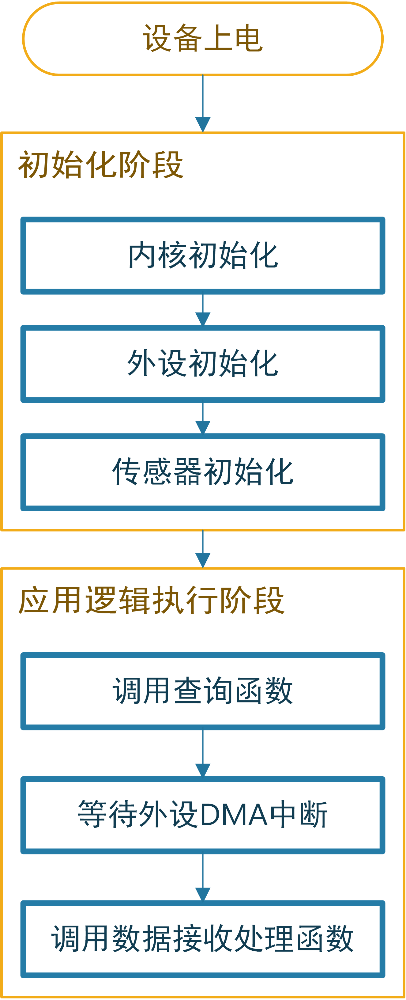

# 数据采集与控制终端设计与实现

## 终端系统主要硬件电路设计与实现

### 终端系统硬件电路总体设计

　　系统硬件系统主要包括电源电路部分、单片机最小系统部分、传感器外设部分、桶盖控制部分，扫码器部分和上位机接口部分。其中传感器外设部分又可以分为温湿度传感器部分、重量传感器部分、桶满传感器部分、用户接近传感器部分和可燃气体传感器部分。硬件系统将终端系统的电源电路、单片机控制核心、传感器外设接口等部分集中在一块电路板上，可以显著减小系统的体积，更具适应性。{@fig:HardwareStructure}所示为系统硬件电路架构设计图。

{#fig:HardwareStructure width=10cm}

　　该设计中，MCU（单片机）用于处理所有的传感器数据并与上位机通信；温湿度传感器、重量传感器、桶满状态传感器、可燃气体传感器用于检测垃圾桶内状态信息；用户接近模块和扫码器模块用于人机交互系统，提供更好的使用体验；上位机接口则用于与Android上位机通信。

### 终端系统单片机最小系统电路设计

　　出于成本和性能以及外设接口的丰富程度的综合考虑，本系统的单片机控制器选择意法半导体公司生产的STM32F103系列型微控制器。STM32F103系列微控制器基于Arm-Cortex-M3内核，主频最高为72MHz，内置Flash空间大小覆盖了从16KBytes到1MBytes的范围。根据内置Flash大小和RAM大小以及单片机针脚数量，STM32F103系列单片机可以分为如{@fig:STM32F103Series}所示的29个型号。

{#fig:STM32F103Series width=16cm}

　　结合系统所需的外设种类和数量以及程序库编译后的二进制体积考虑，本设计选择了STM32F103RE系列单片机，它有64个引脚（其中51个是GPIO引脚，其余13个是电源，晶振等引脚），可以满足系统外设的连接控制需求；同时它内置了512KBytes大小的Flash和64KBytes大小的RAM，可以满足外设驱动和通信协议栈的程序运行。

　　由于本系统不需要在零下40摄氏度以下或85摄氏度以上的极端环境下工作，因此选定微控制器的型号为可在$-40℃~85℃$下工作的STM32F103RET6。

　　该型微控制器基础参数（局部）如{@tbl:STM32F103RET6}所示[@Chong2020]：

| Flash大小 | SRAM大小 | Timer | SPI | I2C | U(S)ART | GPIO | 12位ADC |
| --------- | -------- | ----- | --- | --- | ------- | ---- | ------- |
| 512KB     | 64KB     | 8个   | 3个 | 2个 | 5个     | 51个 | 3个     |
Table:STM32F103RET6型微控制器基础参数表 {#tbl:STM32F103RET6}

　　可以看出该型微控制器的U(S)ART接口资源较为丰富，可以连接控制多个独立的串口设备。本系统所需的单片机最小系统电路与一般的STM32F103RET6系统别无二致，{@fig:MCUCircute}所示是最小系统电路原理图。

{#fig:MCUCircute width=14cm}

　　该电路设计图中包含SWD调试接口、系统指示灯、复位电路、晶振电路、电源电路和MCU引脚等几个部分。

　　SWD调试即串行调试（Serial Wire Debug），是一种最少只需要占用单片机的2个引脚就可以实现内核访问调试的调试协议[@HuangYaPing2012; @HuangGuoWei2019; @Shi2020; @Shi2019]。使用SWD调试接口进行Arm-Cortex内核单片机的调试和程序下载，可以节约外设资源和减小电路板体积。

　　系统指示灯作为系统运行的指示，向系统维护人员传递系统仍在运行的信息。

　　复位电路由复位按键和上电复位电路[@Song2021]组成。STM32的单片机是低电平复位的，当上电时，STM32单片机的NSRT引脚电平为低时，单片机会将内部各寄存器的值重设为初始状态，随后NSRT引脚电平为高时，单片机正常工作，由此完成复位过程。复位电路上有电阻和电容构成的RC电路，这种RC电路可以时NRST引脚上的电压缓慢变化，防止电压突变造成故障。当单片机内部出现故障时，有时也需要对单片机进行复位，这时可以按下复位按键使NSRT引脚接地，完成复位[@Lu2014]。

　　晶振电路是控制器核心电路的核心[@Zhao2016; @Wang2012]，它本身是一种能够把电能和机械能相互转化的晶体，当它在共振条件下工作时，就可以提供稳定，精确的单频信号。通常情况下，普通晶振的频率可以达到百万分之五[@Wang2020]，精度极高。利用它所产生的时钟信号，可以为单片机提供时钟频率，从而驱动单片机的指令执行。

　　STM32F103RET6的电源分为芯片工作电压、ADC参考电压、模拟电压和电池备用电源等，分别对应单片机的11个（5种）引脚。其对应关系如{@tbl:MCUPower}所示。

| VDD        | VSS        | VDDA       | VSSA       | V_BAT    |
| ---------- | ---------- | ---------- | ---------- | -------- |
| 工作正电压 | 工作负电压 | 模拟正电压 | 模拟负电压 | 电池供电 |
Table:STM32F103RET6单片机电源引脚种类 {#tbl:MCUPower}

### 终端系统温湿度传感模块电路设计

　　温湿度传感模块的一般设计思路是通过温度和湿度的传感器安装在垃圾桶内部来检测温湿度，本设计中为了结构的简约以及对节约单片机外设接口资源的考虑，使用温湿度一体传感器[@Lu2008]。现代的温湿度传感器根据原理的不同在结构上千差万别，根据测量对象、测量环境以及稳定性的考虑，本设计选用了YSAT01B型温湿度变送器作为温湿度传感模块的传感器。

　　该型温湿度传感器采用工业通用的RS485[@Xu2009; @FengZiLing2012; @Jia2010]总线和MODBUS协议，可以方便地通过串口进行通信。该型传感器可适配金属保护外壳，在垃圾桶场景下不易损坏。该型传感器技术参数如{@tbl:TempSensorTable}所示。

| 参数名称     | 参数值                        |
| ------------ | ----------------------------- |
| 温度测量范围 | $-30^oC~80^oC$                |
| 温度测量精度 | $\pm0.3^oC(at 25^oC)$         |
| 湿度测量范围 | $0~100RH\%$                   |
| 湿度测量精度 | $\pm 3RH\%$                   |
| 通讯接口     | $RS485(MODBUS-RTU)$           |
| 供电电源     | $DC5~24V$                     |
| 分辨率       | 温度$0.01^oC$，湿度$0.01RH\%$ |
| 功耗         | $\leqslant 0.1W$              |
| 运行环境     | $-40^oC~120^oC,0~100RH\%$     |
Table:YSAT01B型温湿度变送器技术参数 {#tbl:TempSensorTable}

　　容易看出，该型传感器适用于本系统所工作的场景，且精度较高。{@fig:TempSensorImage}所示是该型传感器的外形示意图。

{#fig:TempSensorImage width=11.35cm}

　　传感器有四条引脚接线，分别是电源正负极和RS485总线的AB差分线。根据此接口，设计传感器与单片机控制器之间的接口电路原理如{@fig:TempSensorCircute}所示。

{#fig:TempSensorCircute width=16cm}

　　由于单片机的外设接口只有U(S)ART串口，不具有直接输出485差分信号的能力。本模块采用MAX3485ESA（{@fig:TempSensorCircute}中的U9）实现了一个485与UART电平互转的电路[@Lei2014]，实现了单片机与传感器之间的通信，在单片机端，选择USART1串口作为温湿度通信串口。同时该部分电路设计有串口收发指示灯，用以提示维护人员该传感器与单片机之间的通信情况。

### 终端系统重量传感模块电路设计

　　在垃圾桶使用场景中，如果只依靠桶满传感器传感桶内垃圾容量，有时会出现“虚满”的现象。这是因为垃圾桶内部的垃圾可能存在许多蓬松的体积大（且可折叠压下）的垃圾。为了避免虚满对垃圾回收清理效率的影响，本设计采取桶满传感器与重量传感器结合的方式判断垃圾桶内剩余容量。当桶满传感器报告垃圾桶已满时，系统还要结合重量信息判断桶内是否出现了虚满现象。这样就可以避免系统出现误判。

　　考虑到使用场景中环境可能较为潮湿且重量较大，本设计选用常用于工业场景的悬臂梁式称重传感器[@Bi2020; @Gong2019; @Jin2014]实现对垃圾桶重量的传感。这种传感器的工作原理是惠斯通电桥[@Jin2020]，悬臂的应变区贴有应变片，可以感应到微小应变，并以电阻变化的形式表现，惠斯通电桥的四个桥即应变片。

　　该型传感器的技术参数和安装示意分别如{@tbl:WeightATbl}和{@fig:WeightAFig}所示。

| 参数名称       | 参数值             | 参数名称     | 参数值                      |
| -------------- | ------------------ | ------------ | --------------------------- |
| 量程           | $0~500kg$          | 零点温度漂移 | $0.03\%F.S./10^oC$          |
| 输出灵敏度     | $2.0\pm0.05V/mV$   | 材质         | 铝合金                      |
| 零点输出       | $\pm1\%F.S.$       | 阻抗         | $350\Omega$                 |
| 非线性         | $0.02\%F.S.$       | 绝缘电阻     | $\geqslant5000M\Omega/100V$ |
| 滞后           | $0.03\%F.S.$       | 电压         | $5~15V$                     |
| 重复性         | $0.02\%F.S.$       | 工作温度     | $-20^oC~80^oC$              |
| 蠕变（30分钟） | $0.03\%F.S.$       | 安全超载     | $150\%$                     |
| 温度灵敏度漂移 | $0.03\%F.S./10^oC$ | 极限超载     | $200\%$                     |
Table:悬臂梁式称重传感器的典型技术参数和电气特性 {#tbl:WeightATbl}

{#fig:WeightAFig width=11.35cm}

　　由于单片机内部只有12位的ADC，其模拟信号测量精度最高只有$1/2^{12}V$，不足以满足设计需要。因此，本设计使用KYD-310式数字变送器采集称重传感器的模拟信号转化为数字量供单片机查询。这样控制系统的电路设计和软件设计不许考虑传感器细节，可以直接通过接口查询结果，简化了系统设计，实现了控制系统和外设传感器的解耦分离。{@tbl:WeightDTbl}所示是KYD-310式数字变送器的技术规格。

| 参数名称       | 参数值                |
| -------------- | --------------------- |
| 供电电压       | $10V~30V$             |
| 输入灵敏度     | $0.4mV/V-6mV/V$       |
| 传感器激励电压 | $5V\pm2\%$            |
| A/D参数        | 24位，Delta-Sigma方法 |
| 通信接口       | RS485(MODBUS-RTU)     |
| 精度           | 1/10000               |
| 工作温度       | $-30^oC~60^oC$        |
| 防护等级       | IP64                  |
Table:KYD-310型数字变送器技术规格 {#tbl:WeightDTbl}

　　由于与单片机直接通信的数字变送器采用RS485接口收发数据，所以单片机核心控制板上只需留有485和U(S)ART电平互转电路和接口即可，用于通信的片上外设选择的是USART3。此模块电路原理图与{@fig:TempSensorCircute}极为相似，此处不赘附。

### 终端系统桶满状态传感模块电路设计

　　对于垃圾高度信息，系统只需关心桶内垃圾是否已满，对于具体的高度数值无需详细采集。因此桶内垃圾高度采用E3F-DS30C4型红外接近开关采集，该型传感器可视为一种开关，其在被测表面距离较远时处于常开状态，此时公共端与常开端短路，在被测表面对传感器造成遮挡时处于常闭状态，此时公共端与常闭端短路。电路原理图如{@fig:FullCircute}所示。

{#fig:FullCircute width=5cm}

　　该电路原理图设计中，红外接近开关的输出信号首先经过电阻分压后才接入单片机的PA8引脚，分压比例为$V_{out} = V_{in}\times \frac{3.3}{5.3}$，可以保护单片机免遭过高电压的冲击而损坏。

### 终端系统用户接近传感模块电路设计

　　用户接近传感实际是在测量桶前方用户相距垃圾桶的距离，常用的距离检测方案式采用超声波测距传感器。考虑到超声波传感器的测距角度广、分辨率高以及结构简单可靠的特点[@Chen2021; @Wang2021]，本设计也选用超声波测距传感器进行用户接近的传感。所选用的超声传感器探头与常见的倒车雷达所使用的超声波传感器别无二致，其外观示意图如{@fig:UltrasoundFig}所示。

{#fig:UltrasoundFig width=6cm}

　　该传感器探头需要一定频率的信号才可以驱动，其反馈回的信号也是模拟信号，需要进一步标定才能转换为距离数值，较为复杂，因此，本设计使用了一个AJ-SRO4M-TX驱动模块来辅助完成超声波测距的任务，该模块的外观如{@fig:AJ-SRO4M-TX}所示。

{#fig:AJ-SRO4M-TX width=8cm}

　　该模块的数据通过标准的UART串口进行输出，因此此模块的接口电路不需要其他电平转换电路来适配，可以直接与单片机的UART4外设接口连接。用户接近传感模块电路原理图如{@fig:AJ-SRO4M-TXCircute}所示。

{#fig:AJ-SRO4M-TXCircute width=8cm}

### 终端系统可燃气体浓度传感模块电路设计

　　在厨余垃圾桶中，由于餐厨垃圾较多，如果较长时间不清理，可能会产生一定浓度的沼气等可燃气体[@Hao; @Yang2021]，带来爆炸或燃烧的危险，其他的垃圾桶有时也存在这样的危险。为了获取垃圾桶内的可燃气体浓度，本设计使用了MQ-2可燃气体传感器作为可燃气体传感模块的传感器。

　　MQ-2型可燃气体传感器的原理是使用在清洁空气中电导率较低的二氧化锡（化学式：$SnO_2$）材料，这种材料处在含有可燃气体浓度较高的气体中时，其电导率会随可燃气体浓度的增加而增大[@Zhang2021; @Zhang2019]，该型传感器的技术参数如{@tbl:MQ-2SensorTbl}。因此可以使用简单的电路测量材料的电导率（电阻）获知空气中的可燃气体浓度。如{@fig:MQ-2SensorFig}所示是该型传感器外形示意图和电路原理图，图中(a)是传感器外观示意图，(b)是电路原理图，该电路设计输出的信号是一个模拟信号，使用单片机的ADC1通道4进行采集。

| 参数名称         | 参数值                                        |
| ---------------- | --------------------------------------------- |
| 可燃气体检测浓度 | $300~10000ppm$                                |
| 灵敏度           | $Rs(空气中)/Rs(2000ppm C_3H_8中) \geqslant 5$ |
| 输出电压         | $2.5V-4.0V$                                   |
| 浓度斜率         | $\leqslant 0.6$                               |
Table:MQ-2型可燃气体浓度传感器技术参数表 {#tbl:MQ-2SensorTbl}

{#fig:MQ-2SensorFig width=12cm}

### 终端系统桶盖控制模块电路设计

　　作为智能化的垃圾桶，应当做到良好的使用体验。本设计考虑到用户直接接触垃圾桶可能造成手部的污染，设计了一个桶盖智能控制模块，用户可不接触桶盖就可开关桶盖。作为桶盖控制模块的动力部分，其结构需尽可能简单以获得足够的可靠性。本设计采用一个电动推杆作为开关桶盖的动力来源，响应速度快，可靠性强。

　　电动推杆的驱动原理是利用直流电机配合螺杆驱动内管伸出或缩回，一个典型的电动推杆结构图如{@fig:PutterFig}所示。

{#fig:PutterFig width=12cm}

　　由于电动推杆依靠直流电机驱动，它的控制也十分简单：以24V电压的推杆为例，在推杆的电源上接入+24V，推杆伸出；接入-24V，推杆缩回。因此可以使用GPIO控制继电器电路对该直流电机进行控制，本设计中选择的GPIO为PC9，原理示意图如{@fig:PutterControl}所示。

{#fig:PutterControl width=12cm}

　　为防止因推杆故障或机械故障导致系统无法确定桶盖状态，本设计使用了一个限位开关实现桶盖状态的反馈。限位开关可安装在桶盖与桶身直接接触的地方，需实现桶盖的开启状态与关闭状态下限位开关的状态不同。如此，便可以通过限位开关的状态获知桶盖的实际状态。

### 终端系统扫码器模块电路设计

　　扫码器采用的是ES4650嵌入式影像扫描器，该型扫码器可以快速扫描解码多种一维码、二维码，支持识别手机屏幕等高反射率表面上显示的条码，适用于复杂影像光照环境。该型扫码器还具有自动感应功能，可以在其视野范围内出现物体时自动开始扫描解码。该型扫码器的技术参数如{@tbl:ScannerTbl}所示，外观如{@fig:ScannerFig}所示。

| 参数名称 | 参数值                                    |
| -------- | ----------------------------------------- |
| 输入电压 | $3.4-5.5V DC$                             |
| 电流     | $105mA(待机)，435mA(扫描)@5VDC$           |
| 视场角度 | 水平：$45^o$，垂直：$28^o$                |
| 扫描角度 | 左右$\pm70^o$，上下$\pm72^o$，旋转$360^o$ |
| 温度范围 | $-20^oC-50^oC$                            |
| 湿度范围 | $5\%-95\%(无冷凝)$                        |
| 解码种类 | 10余种二维码，25种条形码                  |
| 通信接口 | RS-232串口，3.3V TTL 电平                 |
Table:ES4650嵌入式影像扫描器参数表 {#tbl:ScannerTbl}

{#fig:ScannerFig width=7cm height=4cm}

　　该型扫码器的通信接口采用RS-232串口[@Yan2020; @Xi2020]进行通信，因此在核心控制板上需要集成一个RS-232和UART电平互转模块。本设计使用SP3232EIM电平互转芯片实现RS-232与UART之间的电平互转，该模块选择的串口为USART2，该芯片在3.3V或5V供电时均可工作，可以保证速率为$250kbits/s$的通信速率，被广泛应用于个人电脑、调制解调器等通信场景。本设计的扫码器模块接口电路原理图如{@fig:ScannerCircute}所示。

{#fig:ScannerCircute width=12cm}

### 终端系统上位机接口部分电路设计

　　根据设计方案，垃圾桶端系统架构应为一台上位机控制多台垃圾桶分控终端。要实现该架构，上位机与垃圾桶分控终端之间就必须采用总线式连接进行通信，常见的通信接口如CAN[@Kan2021]，485[@Chen2021]等都是总线式通信接口，其中485总线因稳定性高、传输距离远[@Xu2009]而常用于工业自动化控制领域，本设计中的单片机和上位机之间的通信接口也采用485总线接口。在分控终端电路上，仍需要一个485与UART电平互转的电路实现单片机端的485通信，电路原理图仍与{@fig:TempSensorCircute}所示电路十分相似；在Android上位机端，可以采用USB-485互转电路实现Android上位机与分控终端之间的485通信，单片机端实现通信的串口使用的是UART5。

　　本设计使用的USB-485互转电路如{@fig:USBTo485}所示。

{#fig:USBTo485 width=14cm}

### 终端系统硬件电路实现

　　根据以上（3.1.1节至3.3.10节）所述，设计了垃圾桶终端系统的各模块硬件电路原理图，并结合EDA（电子设计自动化）软件工具和电气电子元件封装库，进行了PCB的设计。垃圾桶终端系统的硬件电路PCB设计图如{@fig:PCB}所示，其中（a）为PCB的顶层，（b）为PCB的底层。

{#fig:PCB width=16cm}

　　根据此PCB设计图，制作的PCB电路板实物如{@fig:PCBBoard}所示，图中（a）部分对应PCB设计图中的顶层，（b）对应设计图的底层。电路板的制作完成为下文的终端软件设计打下了基础。

{#fig:PCBBoard width=16cm height=8cm}

## 终端系统软件设计与实现

### 终端系统软件整体架构

　　根据系统硬件的设计，系统软件主要需要完成以下几个任务：

#### 采集来自传感器的数据

　　对于系统硬件系统使用的温湿度传感器、重量传感器、桶满传感器、超声波传感器、可燃气体浓度传感器等外设，其数据需要系统软件查询接收才可以正确驱动。收到数据后，系统还需要对数据进行解码以获得传感器感测的数值。

#### 对扫码器扫描二维码作出响应

　　由于用户扫码操作并非时刻进行，当没有用户扫码时，系统不需与扫码器通信；当用户扫码时，系统需要及时接受来自扫码器的数据并解码存储在RAM中。

#### 当用户请求时，控制桶盖开启

　　当有用户求情开盖时，系统首先判断当前垃圾桶内是否存在不适宜开盖的异常状况，然后决定是否通过操作GPIO引脚的电平变化控制继电器进而控制电动推杆的开合。

#### 响应来自上位机的通信请求

　　上位机通过485总线和MODBUS协议与本终端系统进行通信，系统需要接收来自上位机的通信数据并作为MODBUS从机做出响应。

　　结合上述软件系统需要完成的任务和硬件系统的设计，确定软件系统的架构如{@fig:SoftwareStructureFig}所示。

{#fig:SoftwareStructureFig width=11cm}

　　Cortex-M3核心层是Cortex-M3内核及设备的抽象描述代码，它主要管理内核寄存器以及内部存储空间、外设寄存器等资源，同时，核心固件层的程序对MCU硬件的寄存器进行了统一的命名管理，屏蔽了硬件细节，使得对于任何使用同样内核的单片机都可以以同样的方法来操作寄存器。一般情况下，内核代码由芯片的制造厂商提供，或由第三方根据内核标准实现。

　　外设驱动层即对U(S)ART、SPI、IIC、Timer等各种外设进行管理的符合Cortex微控制器软件接口标准（Cortex Microcontroller Software Interface Standard，CMSIS）[@Wang2020a; @Hao2018]的函数库，该层的程序将MCU的外设寄存器操作封装成统一的函数接口，在核心固件层的基础上进一步抽象为用户屏蔽了底层的寄存器细节，使得应用层对于同一外设的操作统一了起来。STM32芯片外设库尚未发展到今天的程度之前，工程师们要开发一个应用，就必须查询参考手册直接操作繁杂众多的寄存器。在行业的不断发展下，现在已经有了许多优秀的外设驱动库实现，如标准外设库（Standard Peripheral Libraries， SPL）、硬件抽象层（Hardware Abstraction Layer，HAL）、底层应用程序接口（Low Layer APIs，LL）和其他的一些第三方实现的函数库。SPL、HAL和LL中，SPL是较早期的实现，由于其在不同型号单片机上的实现并不兼容，因此使用SPL开发的程序并不具有可移植性，目前也在被慢慢淘汰；HAL和LL是较为先进的外设库实现，出于工程化的考虑，它们为不同单片机的外设抽象封装了相同的接口，使得相同的上层外设操作代码可以跨越几乎所有的STM32单片机使用。相比于HAL库，LL库封抽象层次更低，往往是对寄存器操作的简单封装，更接近硬件，因而具有更高的性能表现，也是发布较晚，设计理念较为先进的函数库，因此，本系统的软件实现采用LL库作为外设驱动层。SPL、HAL和LL之间的关系如{@fig:Libraries}所示。

{#fig:Libraries width=12cm}

　　传感器驱动和MODBUS协议栈是应用层程序的一部分，传感器驱动负责管理不同的传感器，为其分别编写操作传感器的接口函数，使上层的应用逻辑开发不必关心传感器的接口等细节；MODBUS协议栈则是为了与上位机之间进行通信而使用的，它作为一个独立的部分管理系统与上位机之间的信息交换。

　　应用逻辑层主要通过调用传感器驱动函数获取传感器感测数据，基于获取的数据进行上层逻辑开发。例如对传感器数据进行滤波处理、对异常数据进行提醒等。同时应用逻辑层也会调用MODBUS协议栈暴露出的接口，例如向协议栈同步最新的传感器数据、从协议栈获取上位机发出的指令等。

### 终端系统温湿度传感模块软件设计

#### 温湿度传感模块驱动设计

　　根据系统硬件的设计，温湿度传感器通过一个485-UART电平互转模块与单片机的USART1串口通信。因此使用此传感器之前需要对单片机的USART1串口进行初始化操作，因为本设计中的所有传感器外设都使用了DMA技术进行外设寄存器与内部RAM之间的数据传递，因此在初始化阶段主要需要对外设的DMA控制器进行初始化。

　　同时该型温湿度传感器的通信协议是MODBUS，其内部的寄存器分配如{@tbl:TempAddrTbl}所示。

| 寄存器地址 | 寄存器数量 | 寄存器说明 | 读写限制 |
| ---------- | ---------- | ---------- | -------- |
| 0x0000     | 1          | 温度寄存器 | 只读     |
| 0x0001     | 1          | 湿度寄存器 | 只读     |
| 0x0064     | 1          | 型号编码   | 读/写    |
| 0x0065     | 1          | 测点总数   | 读/写    |
| 0x0066     | 1          | 设备地址   | 读/写    |
| 0x0067     | 1          | 波特率     | 读/写    |
Table:温湿度传感器MODBUS协议数据地址表 {#tbl:TempAddrTbl}

　　根据此表和MODBUS报文帧格式[@MODBUSStandard1]，可以推算出读取或改写各数据的指令。结合推算出的指令和外设库中的串口操作函数，可以设计出温湿度传感器的驱动函数库。取最为常用的读取温湿度函数为例，其查询指令为`0x01, 0x03, 0x00, 0x00, 0x00, 0x02, 0xC4, 0x0B`，此指令发送后在串口接收中断中收到的数据即温湿度传感器的返回数据帧，根据MODBUS协议规定的报文返回帧格式[@MODBUSStandard1]和{@tbl:TempAddrTbl}中的寄存器分配关系，可以解析返回数据帧以获取查询的数据。

　　在查询时，程序首先清除DMA的TC3标志位，然后将要发送的数据拷贝到发送缓冲区，最后重新使能DMA通道，DMA即自动进行数据的转移；接收时，DMA会自动将串口外设的接收寄存器中的数据运送到接收缓冲区，因此在处理函数中，可以直接读取使用接收缓冲区中的数据。

#### 温湿度传感模块驱动调用流程

　　根据上节中的传感器驱动设计，温湿度传感模块函数在整个系统中的调用流程如{@fig:TempProcess}所示。

{#fig:TempProcess width=5cm}

　　在初始化阶段，系统需要先进行内核时钟、核心资源以及外设的初始化过程，为传感器驱动的正确执行打下基础；在实际使用传感器的应用逻辑阶段，程序首先要进行传感器的初始化，然后根据逻辑需要调用输出查询和接收函数。

### 终端系统重量传感模块软件设计

#### 重量传感模块驱动设计

　　与温湿度传感模块类似，重量传感模块与单片机之间也是通过485总线和MODBUS协议进行通信。因此，重量传感模块驱动函数与温湿度传感器的驱动函数十分相似。只需把温湿度传感器初始化函数中的串口号、DMA相关硬件编号以及缓冲区等参数换成称重传感模块对应的参数，即可实现对称重传感模块的初始化。

　　在传感器的查询及写入操作方面，根据{@tbl:WeightTbl}所示的数据地址表，同样可以推算出各数据的查询指令。

| 寄存器地址 | 寄存器数量 | 寄存器说明   | 读写限制 |
| ---------- | ---------- | ------------ | -------- |
| 0x0050     | 2          | 重量数据     | 只读     |
| 0x005D     | 1          | 手动清零范围 | 读/写    |
| 0x005E     | 1          | 执行手动清零 | 只写     |
Table:重量传感模块MODBUS协议数据地址表 {#tbl:WeightTbl}

　　根据此表，可以用与温湿度传感器极为相似的过程向传感器查询数据，只需把指令换为重量传感器的指令，同时更换串口相关的参数。以最常用的重量数据读取为例，其指令为`{0x01, 0x03, 0x00, 0x50, 0x00, 0x02, 0xC4, 0x1A}`。同样的，在串口的DMA中断发生时，可以直接调用数据接收函数对接收缓冲区中的数据进行解析处理。

#### 重量传感模块驱动调用流程

　　同样的，驱动函数调用过程也如{@fig:TempProcess}所示。

### 终端系统桶满状态传感模块软件设计

#### 桶满状态传感模块驱动设计

　　根据系统硬件设计，桶满状态传感模块通过红外接近开关采集，红外接近开关的输出连接到单片机的PA8引脚上，只需采集这个引脚上的电平状态，即可获取垃圾桶内部的桶满状态。

#### 桶满状态传感模块驱动调用流程

　　对于GPIO的操作流程较为简单，外设方面只需要初始化PA8引脚为输入模式就可以调用驱动函数对引脚电平进行采集。该模块驱动函数调用流程如{@fig:FullProcess}所示。

{#fig:FullProcess width=5cm}

### 终端系统用户接近传感模块软件设计

#### 用户接近传感模块驱动设计

　　用户接近传感模块的硬件设计使用了一个超声波传感探头和AJ-SRO4M-TX超声波探头驱动模块。该驱动模块可以配置成串口自动模式，即该模块以一定的频率主动通过串口发出超声波测距数值。因此，该传感模块的驱动程序不需要额外的数据查询操作，只需要完成单片机的串口外设初始化即可。

#### 用户接近传感模块驱动调用流程

　　超声波传感模块驱动的使用较为简单，只需在完成串口UART4的初始化之后再调用模块的初始化函数，即可实现数据自动接收到数据缓冲区。驱动函数的调用流程如{@fig:UltrasoundProcess}所示。

{#fig:UltrasoundProcess width=5cm}

### 终端系统可燃气体浓度传感模块软件设计

#### 可燃气体浓度传感模块驱动设计

　　可燃气体浓度传感模块输出一个与甲烷等可燃性气体浓度正相关的模拟信号，在硬件设计中，该传感器的输出信号通过单片机的ADC1通道4进行检测。在程序中，首先进行ADC外设的初始化，随后只需要将该ADC通道的DMA设置为循环模式（Circular Mode），单片机的ADC硬件就会不断地根据预先设定的参数进行模拟信号的采集。因此，本模块的驱动函数也十分简单，只需要完成对传感器的初始化，无需额外的数据查询函数。

　　同样地，该传感器驱动函数的调用流程也如{@fig:UltrasoundProcess}所示。

### 终端系统桶盖控制模块软件设计

#### 桶盖控制模块驱动设计

　　桶盖使用电动推杆控制。在硬件上，推杆由单片机的引脚电平通过继电器模块进行控制。根据桶盖的“开”和“关”两种状态，桶盖控制模块的驱动函数主要有两个，分别控制桶盖开启和关闭。

　　在开启函数中，首先需要检测垃圾桶状态，判断垃圾桶内是否存在三种情况中的至少一种：1. 桶内温度过高；2. 桶内已满；3. 桶内垃圾重量超重，如果存在，则不执行开盖命令，反之进行下一步检查。在下一步检查中，系统通过限位器引脚电平判断桶盖状态，如果桶盖已经打开，则不执行命令。

#### 桶盖控制模块驱动调用流程

　　驱动函数调用之前，必须保证控制引脚已经初始化为输出模式，限位器引脚已经初始化为输入模式。驱动函数调用流程如{@fig:PutterProcess}所示。

{#fig:PutterProcess width=5cm}

### 终端系统Modbus协议栈设计

　　为了实现多台智能垃圾桶控制终端与上位机之间的通信，本设计采用485总线和MODBUS总线式通信协议。每台控制终端作为MODBUS协议中的一个从机设备，每个传感器数据作为从机设备中的一个数据寄存器供主机（上位机）查询。由于协议需要通过一个串口硬件实现数据的收发，本设计采用单片机的UART5串口作为MODBUS协议栈的硬件串口；同时协议需要一个硬件定时器作为计时基准以实现通信过程中的精确时序控制，本设计使用单片机的TIM6定时器作为协议栈定时器。

#### 协议栈初始化

　　在协议栈的初始化过程，首先需要初始化使用的TIM6和UART5硬件资源，将其配置成指定的参数并使能。随后配置MODBUS协议栈的模式、设备地址、串口号、波特率等参数，完成后即可使能协议栈在主循环中监听总线请求。

　　值得注意的是，本设计使用了一个拨码开关实现协议栈设备地址的现场维护，维护人员通过波动拨码开关即可调整控制终端的设备地址，不需要复杂的上位机软件，提高了维护效率。拨码开关为四位，采用拉高设计，分别连接到单片机的四个输入引脚上。在软件系统的初始化阶段，系统读取这四个引脚上的电平并进行二进制解码，以解码得到的数据作为设备的地址。

#### 数据地址分配

　　在MODBUS协议栈，数据被存储的位置被称为“寄存器”。因此，数据的地址分配即寄存器的分配，MODBUS协议总共定义了输入寄存器（只读），保持寄存器（读写），线圈（读写）等多种数据模型，在本设计中，考虑各传感器数据应该是只读的，将其放在输入寄存器中；对于桶盖状态数据，其应该是可以控制改写的，且其宽度只有一位，故放在线圈寄存器中。本设计中协议栈内部数据分配如{@tbl:MODBUSTbl}所示。

| 外设类型         | 寄存器类型 | 数据地址 | 数据长度 |
| ---------------- | ---------- | -------- | -------- |
| 温度数据         | 输入寄存器 | 0x00     | 1        |
| 湿度数据         | 输入寄存器 | 0x01     | 1        |
| 可燃气体浓度数据 | 输入寄存器 | 0x02     | 1        |
| 重量数据         | 输入寄存器 | 0x03     | 2        |
| 用户ID信息       | 输入寄存器 | 0x05     | 14       |
| 超声波测距数据   | 输入寄存器 | 0x12     | 1        |
| 桶满状态数据     | 输入寄存器 | 0x14     | 1        |
| 桶盖开合状态     | 线圈       | 0x00     | 1        |
Table:协议栈内部数据地址分配 {#tbl:MODBUSTbl}

#### 通信接口

　　根据{@tbl:MODBUSTbl}所提出的数据地址分配，可以根据MODBUS协议报文帧格式推算出上位机查询和改写主要数据的接口如{@tbl:MODBUSInterfaceTbl}所示（设备地址取`0x01`）。

| 指令                      | 描述               |
| ------------------------- | ------------------ |
| `01 04 00 00 00 01 31 CA` | 读取温度           |
| `01 04 00 01 00 01 60 0A` | 读取湿度           |
| `01 04 00 02 00 01 90 0A` | 读取可燃气体浓度   |
| `01 04 00 03 00 02 81 CB` | 读取重量           |
| `01 04 00 06 00 0D D1 CE` | 读取用户ID         |
| `01 04 00 13 00 01 C0 0F` | 读取超声波测距数据 |
| `01 04 00 14 00 01 71 CE` | 读取桶满状态       |
| `01 01 00 00 00 01 FD CA` | 读取桶盖状态       |
| `01 05 00 00 FF 00 8C 3A` | 开启桶盖           |
| `01 05 00 00 00 00 CD CA` | 关闭桶盖           |
Table:控制终端MODBUS通讯接口 {#tbl:MODBUSInterfaceTbl}

　　通过该表所示的接口，上位机只需通过485总线向从机终端发送指令，即可获取或改写系统内部的数据。

### 终端系统软件实现

　　根据以上（3.2.2节至3.2.7节）所述之传感器驱动函数设计以及3.2.8节所述数据地址分配，结合3.2.1节提出的使用LL外设库的设计。在STM32CubeMX（Version 6.2.1）软件中对软件系统的外设参数、时钟参数、外设预定义等进行了设置，生成了用Makefile[@Cheng2020; @Gu2016]组织的工程框架代码。然后使用VSCODE编辑器和gcc-arm工具链进行上层逻辑的编写和开发。

　　在上层逻辑方面，主要有两个部分：1. 传感器数据采集；2. 用户操作响应和异常数据提醒。

#### 传感器数据采集

　　在传感器数据采集方面，由于本设计中使用了多种需要发送指令以查询数据的传感器外设（如温湿度、重量传感器），为了不让发送查询指令的操作占用主循环的时间，本设计使用了一个硬件定时器来定时进行所有传感器数据查询指令的发送。首先将定时器初始化，然后定时为100ms，随后就可以在定时器的中断函数中调用数据查询函数。这种结构的好处是它相当于将指令发送操作放在另外一个线程中进行，提高了CPU效率。

　　设计中还使用了不需要指令查询的传感器，对于这些传感器，其数据是自动采集的，使用时可直接取用，因此不需要额外的数据采集代码。传感器数据采集部分的软件流程如{@fig:SensorProcess}所示。

{#fig:SensorProcess width=10cm}

#### 用户操作响应和异常数据指示

　　用户操作主要有按键操作、扫码器扫码操作和上位机操作3种方式。对于用户，其操作无外乎开关垃圾桶，因此，对于三种操作方式其操作捕捉方式有所不同，但是最终响应都是相同的。对于按键操作，本设计采用了一个硬件定时器捕捉下降沿的方式捕捉，采用定时器捕捉下降沿的好处是可以做到按键消抖[@Fu2018]，避免了抖动的按键输入信号对程序的影响；对于扫码操作，用户扫描的二维码信息会被存储到协议栈内部，等待上位机进行读取。上位机验证用户ID后向垃圾桶控制终端发送指令实现交互；用户在上位机上的操作被上位机解析为指令后通过协议发送到控制终端，所以扫码操作与上位机操作的控制方式是一致的。在最终的响应方面，如果用户请求开启垃圾桶，系统会查询垃圾桶内部的温度、可燃气体浓度、重量和桶满状态等判断垃圾桶是否适合开启，如果不适合开启将会忽略用户的操作。在获取状态信息时，也会把指标是否正常以指示灯的形式提醒给用户。用户操作响应和异常数据指示部分的算法流程如{@fig:UserOperation}所示。

{#fig:UserOperation width=7cm}

## 本章小结

　　本章通过各个模块的硬件电路和软件的整体设计、模块设计，最终完成了整个控制系统的硬件电路设计以及电路板的制作实现。同时完成了控制软件的设计和开发，软件下载到制作的硬件电路板上工作正常，在与测试上位机通信时，未出现丢包误码等现象，稳定性较好。同时各路传感器数据均能正常采集，推杆也正常响应，可以顺利开关桶盖。本设计实现的智能垃圾桶控制终端以及外部传感器的安装实物如{@fig:TrashBinFig}所示。图中(a)(b)分别是垃圾桶在关盖和开盖状态下的图像，图(b)中，编号为1的方框中是智能垃圾桶控制终端硬件电路、编号为2的方框中是嵌入式扫码器、编号为3的方框中是超声波传感器、编号为4的方框中是按键、编号为5的方框中从上到下依次是可燃气体传感器、桶满传感器和温湿度传感器。[^1]

[^1]:控制系统软件的详细文档和代码实现见附件A

{#fig:TrashBinFig width=15cm height=9cm}

