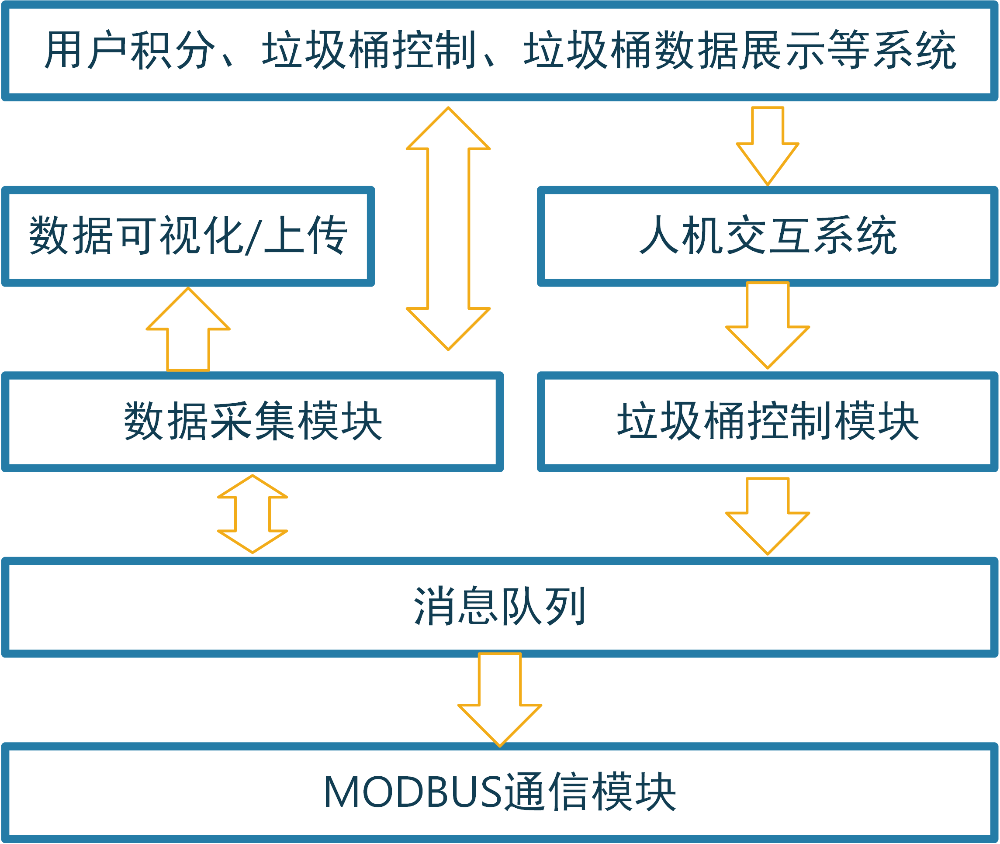
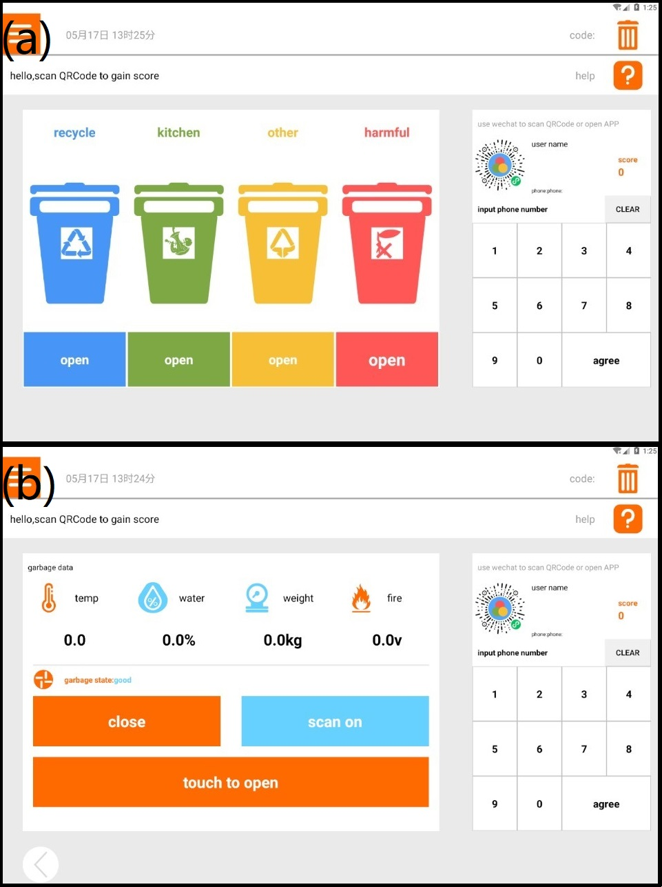
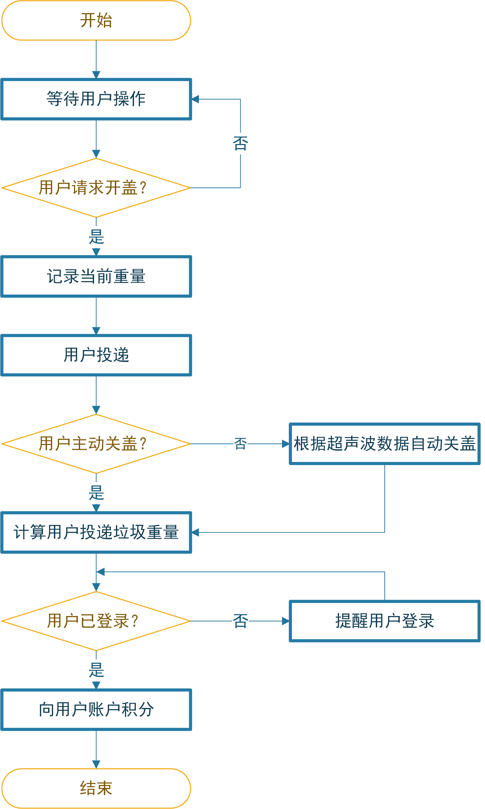
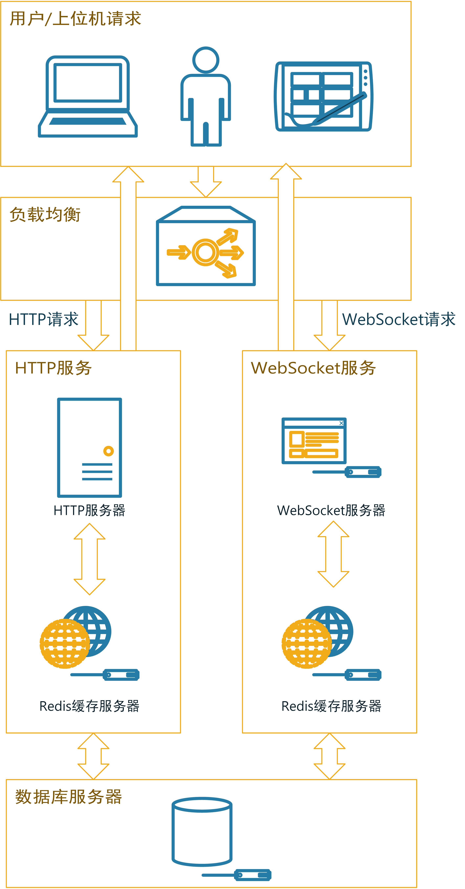
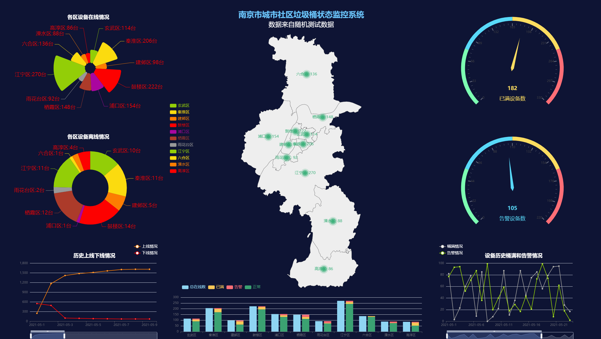

# 信息化平台软件设计

跟据第二章中的系统架构设计，信息化平台软件系统主要由信息化平台上位机交互系统、信息化平台服务器后端系统和信息化平台数据应用系统组成。

## 信息化平台上位机交互系统设计

### 信息化平台上位机交互系统整体设计

　　信息化平台上位机交互系统是智能垃圾桶状态数据的采集终端，同时也是用户查看垃圾桶信息以及操作垃圾桶的主要交互途径。本系统的交互系统设计为运行在Android操作系统上的程序，交互系统定时向其所连接的所有垃圾桶请求数据并在系统界面上可视化并上传服务器。当用户通过交互系统操作时，系统通过向垃圾桶控制系统发送指令响应用户的操作。不难看出，上位机与垃圾桶控制系统之间只有一个交互途径：Modbus协议，因此，本设计中的上位机维护一个Modbus消息队列，当系统需要向垃圾桶控制系统请求数据或发送指令控制时，就向消息队列中添加一个指令消息；同时，上位机的通信模块会定时从消息队列中取出消息进行发送。

　　用户交互方面，当用户扫码时，上位机系统会从垃圾桶分控系统中读取到用户的二维码ID，然后将此ID向服务器端查证。如果ID有效，则本次投递行为会被积分。

　　上位机交互系统的软件架构设计如图{@fig:UpmechineStructure}所示。

{#fig:UpmechineStructure width=10cm}

### 数据采集与可视化渲染模块

　　数据采集模块是系统的根基，系统依赖该模块来实现垃圾桶状态数据的采集，几乎所有上层应用都需要该模块采集的信息。该模块基于谷歌的开源项目android-serialport-api所实现的Android串口通讯功能，结合3.2.8.2节表{@tbl:MODBUSInterfaceTbl}所述的通信接口设计实现垃圾桶控制系统的数据请求。串口通讯实例采用单独的service实现，降低与系统其他模块的耦合度，便于后期对系统的升级和维护。采集到的数据被存储到抽象的垃圾桶对象中，随后实时渲染在UI界面上。系统的UI界面设计如图{@fig:AndroidUIFig}所示。

{#fig:AndroidUIFig wigth=13cm height=14cm}

### 垃圾桶状态数据上传模块

　　采集到的数据暂存在系统内存中，考虑到垃圾桶终端遍布城市，数据量极大，以40分钟为周期向服务器通讯以上传数据包，数据包中包含的信息如表{@tbl:DataPackTbl}所示。

| 数据字段 | 字段含义           | 类型   |
| -------- | ------------------ | ------ |
| temp     | 桶内实时温度       | 数值   |
| humity   | 桶内实时湿度       | 数值   |
| gas      | 桶内可燃气体浓度   | 数值   |
| weight   | 垃圾桶内重量       | 数值   |
| isfull   | 垃圾桶是否已满     | 数值   |
| id       | 垃圾桶组唯一识别码 | 字符串 |
| position | 垃圾桶组位置       | 字符串 |
Table:上位机向服务器上传数据包字段表 {#tbl:DataPackTbl}

　　其中垃圾桶内部的温度、湿度、可燃性气体浓度等垃圾桶内部状态信息来自垃圾桶控制系统采集的数据，数据以对象数组形式上传，数组中每个数据项代表每个垃圾桶的状态，因此数组的长度实际上就是上位机所连接的分控系统数量；id信息为根据垃圾桶组的部署位置编码出的一个唯一识别码；位置信息来自于上位机的Android运行平台通过GPS定位系统采集到的位置信息，这个信息代表上位机所控制的所有垃圾桶的统一位置。

　　服务器无法做到主动向所有部署的垃圾桶设备请求数据，只能由垃圾桶的上位机主动向服务器推送数据。因此，上位机与服务器之间无法使用只能由客户端单端请求的HTTP协议[@HTTP]进行通信。本设计中，上位机通过WebSocket协议[@Li2021]向服务器推送数据，WebSocket协议是一种服务端和客户端双端平等的通讯协仪，十分适用本系统的信息推送需要。

### 用户交互模块

　　在上位机系统UI的首页上，用户可以点击每个垃圾桶下方的按钮进行垃圾桶盖的控制，也可以点击要控制的垃圾桶，在垃圾桶的详情页面控制垃圾桶。若垃圾桶内部状态不适宜开盖，则所有开盖按钮都不可点击，同时，UI上会出现对用户的提醒。

　　当用户通过垃圾桶上的扫码器扫描二维码后，上位机会采集到该二维码信息并向服务器发送一条包含该信息的报文，服务器收到该报文后会查询该二维码ID是否有效，并把结果返回给上位机。若用户登录有效，则UI上会显示该用户的ID和积分信息，同时，上位机系统开始记录当前垃圾桶内的垃圾重量$W_1$，当用户完成投递并关盖后，系统再次采集垃圾桶内垃圾重量$W_2$，则用户实际投递的垃圾重量为$W_2-W_1$，系统将根据此重量为用户计算积分。当用户开启垃圾桶盖后，系统开始关注垃圾桶前方的超声波测距数据。若超声波测距数据显示用户已不在垃圾桶前且超过一定时长，就会自动控制垃圾桶关闭。

　　用户与上位机交互的流程如图{@fig:HMIProcess}所示。

{#fig:HMIProcess width=10cm}

## 信息化平台服务器后端系统设计

### 服务端整体架构

　　服务器后端系统收集并储存所有上位机系统推送的数据，基于服务端收集和存储的大量数据，可以驱动多种多样的应用系统。如城市垃圾桶管理系统等，这类据应用不仅使城市向数字化、智能化更进一步，还可以大大提高城市垃圾桶的管理水平。本设计通过Android上位机系统和WebSocket协议来进行垃圾桶状态信息的传递，则服务器端需要与之对接，实现数据的接收和持久化；同时，对于上位机的请求（如用户ID验证请求），服务端系统也需要及时响应。由于部署的垃圾桶设备遍布城市，数量较大，因此服务端系统需要使用负载均衡等多种技术缓解服务器压力，实现与客户端稳定的通信。服务端系统的架构如图{@fig:ServerStructure}所示。

{#fig:ServerStructure width=11cm}

　　如图中所示，用户和上位机的请求基本可分为两种类型：用户访问数据应用产生的HTTP请求和上位机系统向服务器推送数据而产生的WebSocket请求。向服务器发出的请求经过负载均衡层分别交由HTTP服务器和WebSocket服务器进行处理并响应。在处理过程中，使用Redis缓存服务器对高并发、大量数据IO的情形进行优化。同时数据以一定的频率存储到对象数据库服务器中。

### 服务端接口设计

　　根据系统整体架构设计，上位机终端采集到的数据通过HTTP请求上传到服务端，系统数据上传的Socket连接接口为：wss://site.maple.today/RubbishSeparator/InteractSocket_separator/{Id}/{latitude}/{longitude}，其中{Id}为终端唯一标识符，{latitude}为终端所在位置的维度信息，{longitude}为经度信息。完成Socket连接后，垃圾桶上位机可以进行垃圾桶数据包的上传，数据包报文格式如表{@tbl:UploadInterface}所示。

| 第一组 | 第二组  | 第三组  | 第四组  | 第五组  | ... |
| ------ | ------- | ------- | ------- | ------- | --- |
| 功能码 | 数据包1 | 数据包2 | 数据包3 | 数据包4 | ... |
Table:垃圾桶上位机与服务端数据传输报文格式 {#tbl:UploadInterface}

　　根据功能码的不同，数据包的含义也不同，具体关系如表{@tbl:CodeToDatapackTbl}所示。

| 功能码 | 功能           | 数据包1       | 数据包2        | 数据包3       | 数据包4       | ... |
| ------ | -------------- | ------------- | -------------- | ------------- | ------------- | --- |
| 1001   | 心跳检测       | -             | -              | -             | -             | -   |
| 1002   | 垃圾桶数据上传 | 1号垃圾桶状态 | 2号垃圾桶状态  | 3号垃圾桶状态 | 4号垃圾桶状态 | ... |
| 1003   | 上传用户积分   | 用户ID        | 用户获取的积分 | -             | -             | -   |
| 1004   | 用户登录       | 用户ID        | -              | -             | -             | -   |
Table:功能码与数据包含义对照表 {#tbl:CodeToDatapackTbl}

　　其中，垃圾桶状态数据数据包中的数据为线性排列，其结构如表{@tbl:TrashcanDataStructure}所示。

| 第一位   | 第二位   | 第三位           | 第四位   | 第五位       |
| -------- | -------- | ---------------- | -------- | ------------ |
| 温度数据 | 湿度数据 | 可燃气体浓度数据 | 重量数据 | 桶满状态数据 |
Table:垃圾桶状态数据包格式 {#tbl:TrashcanDataStructure}

　　本服务器系统所收集的数据可以驱动多种多样的数据应用，因此，服务器系统也为其他应用的开发预留了数据请求的接口。本系统中垃圾桶数据请求接口为：https://site.maple.today/RubbishSeparator/MainMobile。,通过此接口可以获取指定一个或多个垃圾桶的数据信息。[^2]

### 用户登录和积分模块设计

　　用户信息预先注册在数据库中，当用户通过上位机交互系统登录时，上位机交互系统会将用户ID信息发送至服务端进行验证。服务端系统处理该信息并返回验证结果。

　　当用户通过垃圾分类投递产生积分时，上位机交互系统会将用户ID和计算好的积分数据打包发送到服务端。服务端系统会处理这个数据包并在服务端更新用户积分，同时将用户ID和更新后的积分打包返回给上位机交互系统。用户登录和积分模块的服务端处理流程大致如图{@fig:UserScoreProcess}所示。

{#fig:UserScoreProcess width=10cm}

### 信息化平台服务器系统技术选型

　　在服务器主机方面，目前主要分为物理主机服务器和云服务器。物理主机服务器指实际的服务器硬件系统，一般部署在服务器机房的机架上，物理服务器主机稳定性高、性能和可控性好，但是缺点是价格昂贵、维护困难。云服务器则因其无需机房、启动成本低、方便易用的优点称为目前中小型服务端系统的首选，因此本系统的服务器选择云服务器作为软件系统的宿主。在国内的云服务器市场中，阿里云因布局较早，服务较优现已是国内最大的公共云计算服务提供商，本系统所使用的云服务器也来自阿里云。

　　服务器后端系统主要基于JavaWeb技术和Tomcat容器[@Yang2021a]，使用Spring Boot框架[@Wang2016]开发而成，主要实现对用户请求、智能垃圾桶上位机终端请求的监听和处理以及数据持久化功能，对于IO密集的数据库读写操作，本系统还使用了Redis缓存技术[@Fang]实现性能优化，提高了系统的数据吞吐能力。

### 城市垃圾桶信息可视化系统

　　基于智能垃圾桶终端上传的信息和服务端系统对信息的接收和托管，可以实现城市垃圾桶的信息化管理。服务端系统中的数据实际上可以用于实现很多不同维度的应用，本文抛砖引玉式地设计一套城市垃圾桶信息可视化系统，实现监控城市智能垃圾桶状态的信息化大屏，希望为其他应用的开发起到一点参考和启发。

　　本设计采用来自Apache的开源图表项目ECharts[@Li2018]，ECharts是一个JavaScript语言开发的可视化图表库，可以运行在任何支持浏览器功能的设备中。ECharts提供多种可视化图表类型，并且支持千万级别的前端数据的渲染。同时它支持多种交互动效以及多种维度的数据支持，是一个十分适合用于数据可视化领域的图表组件库。

　　本系统可从各区设备在线数、各区设备离线数、各区垃圾桶桶满情况、各区垃圾桶告警情况以及历史垃圾桶上线下线和历史垃圾桶告警情况等多个维度进行监控。系统的设计UI如图{@fig:web}所示。

{#fig:web width=16cm}

　　由于本设计实现的系统实际并未大规模部署，图中所示的数据来自后台随机生成的测试数据，仅用于体现系统效果。但是该可视化系统面向实际开发，向服务器请求数据以及数据处理的接口设计与实际情况别无二致，可以做到对真实数据的处理和监控。

## 本章小结

　　本节详细介绍了信息化平台系统的各模块设计，首先通过上位机交互系统架构设计，结合垃圾桶控制系统的Modbus协议栈设计和谷歌开源项目android-serialport-api实现了对与垃圾桶的Modbus通信。在实现通信的基础上，通过设计消息队列中间层和数据采集以及垃圾桶控制模块，实现了对垃圾桶的状态采集和控制。最后结合获取的数据实现了数据的可视化/上传模块以及用户交互模块。该上位机模块相当于系统的物联网数据终端，其通过WebSocket协议可以实现对服务器的数据推送，是整个信息化系统的数据来源。[^3]随后本章在上位机系统实现的基础上对系统服务器后端软件进行了设计和开发，进行了服务端架构设计、接口设计和用户登录和积分流程设计。随后基于系统需求和物理主机、云服务器的特点进行了服务器选型，为服务端程序的开发实现奠定了基础。最后基于JavaWeb技术、Tomcat容器、Spring Boot框架等对服务端软件进行了开发和实现。[^4]服务端系统的设计和实现为数据应用的设计打下了基础，实现了系统数据的云端同步，真正做到了智能垃圾桶系统的信息化管理。同时本章还设计了一个简单的数据应用（城市垃圾桶信息可视化系统），通过对系统数据进行多维度的分析和可视化渲染，做到了城市垃圾桶部署和运行情况的可视化展现。

[^2]:系统接口详细文档见附录A
[^3]:上位机系统的具体实现见附录A
[^4]:服务端系统的具体代码实现见附录A
