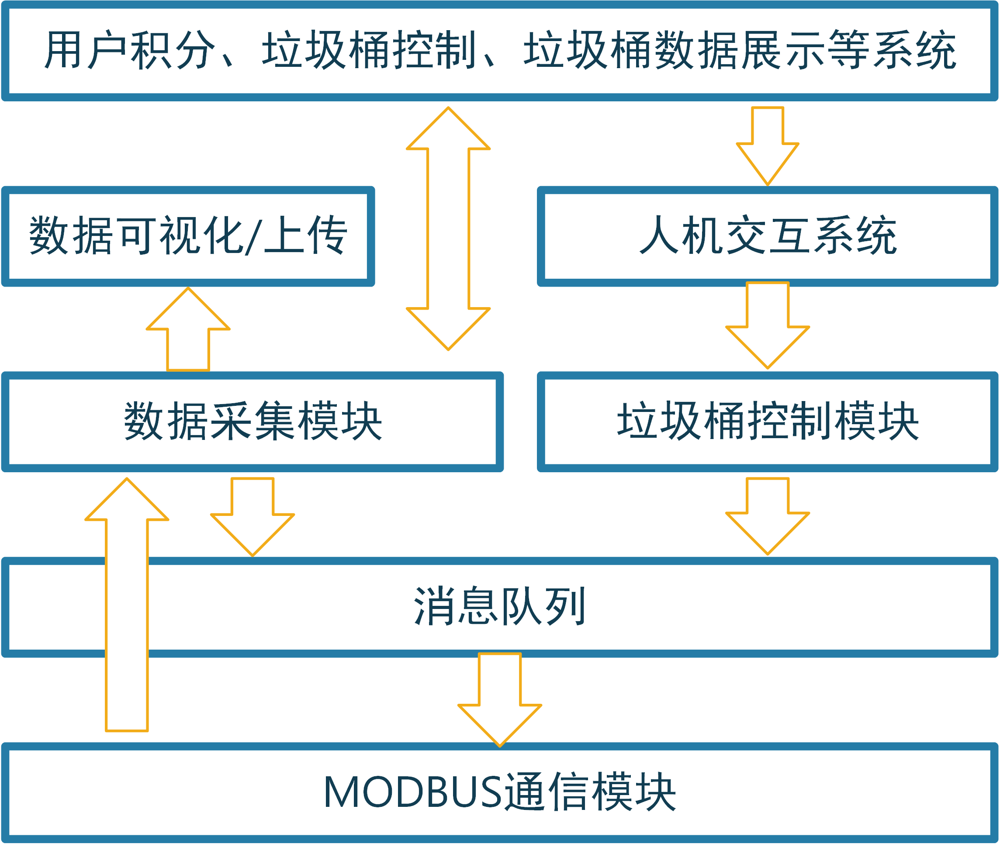

# 上位机交互系统设计与实现

## 上位机交互系统整体设计

　　上位机交互系统是垃圾桶控制终端与服务器之间的中继，同时也是用户查看垃圾桶信息以及操作垃圾桶的主要交互途径。本系统的交互系统设计为运行在Android操作系统上的程序，交互系统定时向其所连接的所有垃圾桶请求数据并在系统界面上可视化并上传服务器。当用户通过交互系统操作时，系统通过向垃圾桶控制系统发送指令响应用户的操作。不难看出，上位机与垃圾桶控制系统之间只有一个交互途径：MODBUS协议，因此，本设计中的上位机维护一个MODBUS消息队列，当系统需要向垃圾桶控制系统请求数据或发送指令控制时，就向消息队列中添加一个指令消息；同时，上位机的通信模块会定时从消息队列中取出消息进行发送。

　　用户交互方面，当用户扫码时，上位机系统会从垃圾桶分控系统中读取到用户的二维码ID，然后将此ID向服务器端查证。如果ID有效，则本次投递行为会被积分。

　　上位机交互系统的软件架构设计如图{@fig:UpmechineStructure}所示。

{#fig:UpmechineStructure width=10cm}

## 数据采集与可视化

　　数据采集模块是系统的根基，系统依赖该模块来实现垃圾桶状态数据的采集，几乎所有上层应用都需要该模块采集的信息。该模块基于谷歌的开源项目android-serialport-api所实现的Android串口通讯功能，结合3.2.8.2节表{@tbl:MODBUSInterfaceTbl}所述的通信接口设计实现垃圾桶控制系统的数据请求。串口通讯实例采用单独的service实现，降低与系统其他模块的耦合度，便于后期对系统的升级和维护。采集到的数据被存储到抽象的垃圾桶对象中，随后实时渲染在UI界面上。系统的UI界面设计如图{@fig:AndroidUIFig}所示。

{#fig:AndroidUIFig wigth=13cm height=14cm}

## 数据上传

　　采集到的数据暂存在系统内存中，考虑到垃圾桶终端遍布城市，数据量极大，以40分钟为周期向服务器通讯以上传数据包，数据包中包含的信息如表{@tbl:DataPackTbl}所示。

| 数据字段 | 字段含义           | 类型   |
| -------- | ------------------ | ------ |
| temp     | 桶内实时温度       | 数值   |
| humity   | 桶内实时湿度       | 数值   |
| gas      | 桶内可燃气体浓度   | 数值   |
| weight   | 垃圾桶内重量       | 数值   |
| isfull   | 垃圾桶是否已满     | 数值   |
| id       | 垃圾桶组唯一识别码 | 字符串 |
| position | 垃圾桶组位置       | 字符串 |
Table:上位机向服务器上传数据包字段表 {#tbl:DataPackTbl}

　　其中垃圾桶内部的温度、湿度、可燃性气体浓度等垃圾桶内部状态信息来自垃圾桶控制系统采集的数据，数据以对象数组形式上传，数组中每个数据项代表每个垃圾桶的状态，因此数组的长度实际上就是上位机所连接的分控系统数量；id信息为根据垃圾桶组的部署位置编码出的一个唯一识别码；位置信息来自于上位机的Android运行平台通过GPS定位系统采集到的位置信息，这个信息代表上位机所控制的所有垃圾桶的统一位置。

　　服务器无法做到主动向所有部署的垃圾桶设备请求数据，只能由垃圾桶的上位机主动向服务器推送数据。因此，上位机与服务器之间无法使用只能由客户端单端请求的HTTP协议[@HTTP]进行通信。本设计中，上位机通过WebSocket协议[@Li2021]向服务器推送数据，WebSocket协议是一种服务端和客户端双端平等的通讯协仪，十分适用本系统的信息推送需要。

## 用户交互

　　在上位机系统UI的首页上，用户可以点击每个垃圾桶下方的按钮进行垃圾桶盖的控制，也可以点击要控制的垃圾桶，在垃圾桶的详情页面控制垃圾桶。若垃圾桶内部状态不适宜开盖，则所有开盖按钮都不可点击，同时，UI上会出现对用户的提醒。

　　当用户通过垃圾桶上的扫码器扫描二维码后，上位机会采集到该二维码信息并向服务器发送一条包含该信息的报文，服务器收到该报文后会查询该二维码ID是否有效，并把结果返回给上位机。若用户登录有效，则UI上会显示该用户的ID和积分信息，同时，上位机系统开始记录当前垃圾桶内的垃圾重量$W_1$，当用户完成投递并关盖后，系统再次采集垃圾桶内垃圾重量$W_2$，则用户实际投递的垃圾重量为$W_2-W_1$，系统将根据此重量为用户计算积分。当用户开启垃圾桶盖后，系统开始关注垃圾桶前方的超声波测距数据。若超声波测距数据显示用户已不在垃圾桶前且超过一定时长，就会自动控制垃圾桶关闭。

　　用户与上位机交互的流程如图{@fig:HMIProcess}所示。

{#fig:HMIProcess width=10cm}

## 小结

　　本节通过上位机交互系统架构设计，结合垃圾桶控制系统的MODBUS协议栈设计和谷歌开源项目android-serialport-api实现了对与垃圾桶的MODBUS通信。在实现通信的基础上，通过设计消息队列中间层和数据采集以及垃圾桶控制模块，实现了对垃圾桶的状态采集和控制。最后集合获取的数据实现了数据的可视化/上传模块以及用户交互模块。该上位机模块相当于系统的物联网数据终端，其通过WebSocket协议可以实现对服务器的数据推送，为下文服务器系统的设计和实现打下了基础。[^2]

[^2]:上位机系统的具体实现见附录