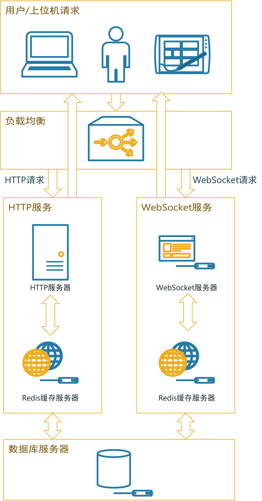

# 服务器后端系统设计与实现

## 服务端整体架构

服务器后端系统收集并储存所有来自上位机系统推送的数据，基于服务端收集和存储的大量数据，可以驱动多种多样的应用系统。如城市垃圾桶管理系统等数，这类据应用不仅使城市向数字化、智能化更进一步，还可以大大提高城市垃圾桶的管理成本和管理效果。本设计提出的Android上位机系统可以收集垃圾桶数据并上传至服务器，服务器端需要与之对接，实现数据的接收和持久化；同时，对于上位机的请求（如用户ID验证请求），服务端系统也需要及时响应。由于部署的垃圾桶设备遍布城市，数量较大，因此服务端系统需要使用负载均衡等多种技术缓解服务器压力，实现与客户端稳定的通信。服务端系统的架构如图{@fig:ServerStructure}所示。

{#fig:ServerStructure width=11cm}

如图中所示，用户和上位机的请求基本可分为两种类型：用户访问数据应用产生的WebSocket请求和上位机系统向服务器推送数据而产生的HTTP Post请求。向服务器发出的请求经过负载均衡层分别交由HTTP服务器和WebSocket服务器进行处理并响应。在处理过程中，使用Redis缓存服务器对高并发、大量数据IO的情形进行优化。同时数据以一定的频率存储到对象数据库服务器中。

## 服务器接口设计

根据系统整体架构设计，垃圾桶上位机终端采集到的数据通过HTTP请求上传到服务端，系统数据上传的Socket连接接口为：wss://site.maple.today/RubbishSeparator/InteractSocket_separator/{Id}/{latitude}/{longitude}，其中{Id}为终端唯一标识符，{latitude}为终端所在位置的维度信息，{longitude}为经度信息。完成Socket连接后，垃圾桶上位机可以进行垃圾桶数据包的上传，数据包报文格式如表{@tbl:UploadInterface}所示。

| 第一组 | 第二组  | 第三组  | 第四组  | 第五组  | ... |
| ------ | ------- | ------- | ------- | ------- | --- |
| 功能码 | 数据包1 | 数据包2 | 数据包3 | 数据包4 | ... |
Table:垃圾桶上位机与服务端数据传输报文格式 {#tbl:UploadInterface}

根据功能码的不同，数据包的含义也不同，具体关系如表{@tbl:CodeToDatapackTbl}所示。

| 功能码 | 功能           | 数据包1       | 数据包2        | 数据包3       | 数据包4       | ... |
| ------ | -------------- | ------------- | -------------- | ------------- | ------------- | --- |
| 1001   | 心跳检测       | -             | -              | -             | -             | -   |
| 1002   | 垃圾桶数据上传 | 1号垃圾桶状态 | 2号垃圾桶状态  | 3号垃圾桶状态 | 4号垃圾桶状态 | ... |
| 1003   | 上传用户积分   | 用户ID        | 用户获取的积分 | -             | -             | -   |
| 1004   | 用户登录       | 用户ID        | -              | -             | -             | -   |
Table:功能码与数据包含义对照表 {#tbl:CodeToDatapackTbl}

其中，垃圾桶状态数据数据包中的数据为线性排列，其结构如表{@tbl:TrashcanDataStructure}所示。

| 第一位   | 第二位   | 第三位           | 第四位   | 第五位       |
| -------- | -------- | ---------------- | -------- | ------------ |
| 温度数据 | 湿度数据 | 可燃气体浓度数据 | 重量数据 | 桶满状态数据 |
Table:垃圾桶状态数据包格式 {#tbl:TrashcanDataStructure}

本服务器系统所收集的数据可以驱动多种多样的数据应用，因此，服务器系统也为其他应用的开发预留了数据请求的接口。本系统中垃圾桶数据请求接口为：https://site.maple.today/RubbishSeparator/MainMobile。,通过此接口可以获取指定一个或多个垃圾桶的数据信息。[^3]

[^3]: 系统接口详细文档见附录

## 用户登录和积分模块设计

用户信息预先注册在数据库中，当用户通过交互系统登录时，上位机交互系统会将用户ID信息发送至服务端进行验证。服务端系统处理该信息并返回验证结果。

当用户通过垃圾分类投递产生积分时，上位机交互系统会将用户ID和计算好的积分数据打包发送到服务端。服务端系统会处理这个数据包并在服务端更新用户积分，同时将用户ID和更新后的积分打包返回给上位机交互系统。用户登录和积分模块的服务端处理流程大致如图{@fig:UserScoreProcess}所示。

{#fig:UserScoreProcess width=10cm}

## 智慧城市垃圾桶信息化平台

基于智能垃圾桶终端上传的信息和服务端系统对信息的接收和托管，可以实现城市垃圾桶的信息化管理。服务端系统中的数据实际上可以用于实现很多不同维度的应用，本文抛砖引玉式地设计一套智慧城市垃圾桶信息化平台，实现监控城市智能垃圾桶状态的信息化大屏，希望为其他应用的开发起到一点参考和启发。

本设计采用来自Apache的开源图表项目ECharts[@Li2018]，ECharts是一个JavaScript语言开发的可视化图表库，可以运行在任何支持浏览器功能的设备中。ECharts提供多种可视化图表类型，并且支持千万级别的前端数据的渲染。同时它支持多种交互动效以及多种维度的数据支持，是一个十分适合用于数据可视化领域的图表组件库。

本设计中实现的垃圾桶信息化平台可从各区设备在线数、各区设备离线数、各区垃圾桶桶满情况、各区垃圾桶告警情况以及历史垃圾桶上线下线和历史垃圾桶告警情况等多个维度进行监控。系统的设计UI如图{@fig:web}所示。

{#fig:web width=15cm}

由于本设计实现的系统实际并未大规模部署，图中所示的数据来自后台随机生成的测试数据，仅用于体现系统效果。但是该可视化系统面向实际开发，向服务器请求数据以及数据处理的接口设计与实际情况别无二致，可以做到对真实数据的处理和监控。

## 服务器后端系统实现

目前的服务器主要分为物理主机服务器和云服务器。物理主机服务器指实际的服务器硬件系统，一般部署在服务器机房的机架上，物理服务器主机稳定性高、性能和可控性好，但是缺点是价格昂贵、维护困难。云服务器则因其无需机房、启动成本低、方便易用的优点称为目前中小型服务端系统的首选，因此本系统的服务器选择云服务器作为软件系统的宿主。在国内的云服务器市场中，阿里云因布局较早，服务较优现已是国内最大的公共云计算服务提供商，本系统所使用的云服务器也来自阿里云。

服务器后端系统主要基于JavaWeb技术和Tomcat容器[@Yang2021a]，使用Spring Boot框架[@Wang2016]开发而成，主要实现对用户请求、智能垃圾桶上位机终端请求的监听和处理以及数据持久化功能，对于IO密集的数据库读写操作，本系统还使用了Redis缓存技术[@Fang]实现性能优化，提高了系统的数据吞吐能力。

## 小结

本章在垃圾桶控制终端的软硬件实现和上位机系统实现的基础上对系统服务器后端软件进行了设计和开发，进行了服务端架构设计、接口设计和用户登录和积分流程设计。随后基于系统需求和物理主机、云服务器的特点进行了服务器选型，为服务端程序的开发实现奠定了基础。最后基于JavaWeb技术、Tomcat容器、Spring Boot框架等对服务端软件进行了开发和实现。服务端系统的设计和实现为数据应用的设计打下了基础。[^4]

[^4]:服务端系统的具体代码实现见附录