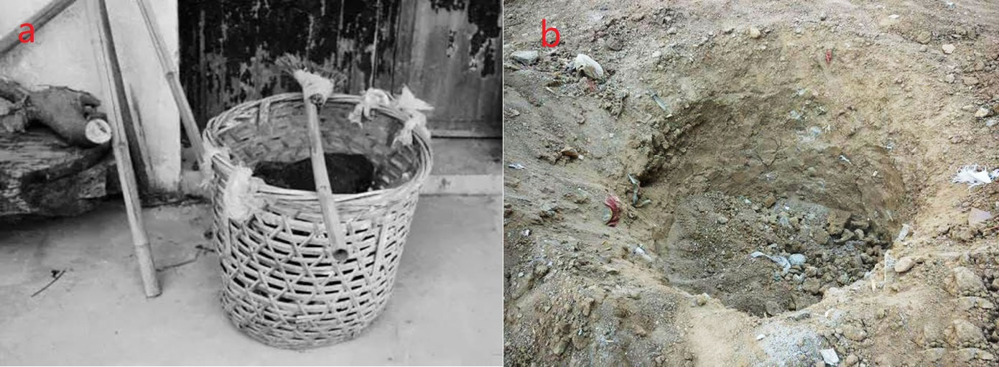
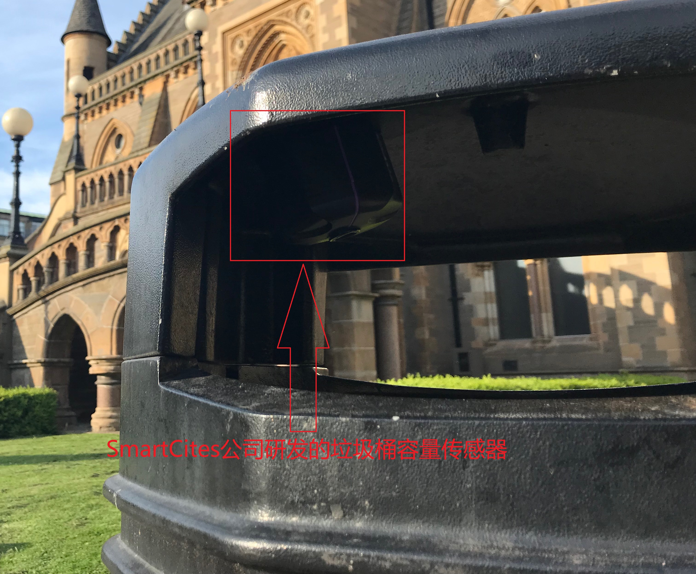

摘要

　　随着我国经济社会的发展和人民生活水平的不断提高，城市垃圾的产生速度也在飞速增长，如何妥善处理和利用城市生活垃圾成为国家和地方政府部门的重要议题。垃圾桶作为居民生活垃圾与垃圾处理厂之间的接口，在垃圾回收中承担重要的角色。目前部分城市已在部分社区部署智能化的垃圾桶，取得了较好的效果。通过智能垃圾桶终端实时获取垃圾桶状态，可以极大地提高社区垃圾桶地清理和回收效率，提高管理便捷性。

　　本设计以STM32F103RET6单片机作为控制核心，加之温湿度传感器，称重传感器，桶满（红外）传感器等多种传感器和推杆等外设，实现了实时采集垃圾桶内部的状态信息，且可通过推杆控制桶盖的自动开启，构成了一个集状态监测和智能控制功能为一体的智能垃圾桶数据采集和控制终端。

　　终端系统通过传感器采集的数据暂存在单片机的内部RAM中，运行在安卓系统上的上位机系统通过Modbus协议与之通信以读取垃圾桶状态数据。上位机系统将垃圾桶状态数据可视化处理并以一定时间间隔向服务端上传，服务端根据通信协议解析数据，并将之存储在数据库。

　　数据库中存储的垃圾桶实时状态数据可以驱动多种应用，本设计平实现的“智慧城市垃圾桶信息化台”就是一种。平台将来自各垃圾桶的状态数据在地图上可视化，形成一个直观的垃圾桶状态监测系统，方便管理人员实时掌握垃圾桶状态。当有垃圾桶状态异常或功能故障时，平台还会主动发出警告提醒工作人员对其进行检查，大大提高了城市垃圾桶维护效率。

　　同时本设计结合积分系统，对于积极分类投放生活垃圾的居民予以积分奖励，可以大大提高居民的垃圾分类意识和积极性，将垃圾分类回收落到实处。

关键词：物联网，智慧城市，嵌入式系统，大数据

ABSTRACT

　　With the development of the economy and society and the continuous improvement of people’s living standards, the rate of urban waste generation is also rapidly increasing. How to properly handle and utilize urban domestic waste has become an important issue for national and local government departments. As the interface between the household garbage and the garbage treatment plant, the trash can plays an important role in the garbage collection process. At present, some cities have deployed intelligent trash cans in some communities and achieved good results. Obtaining real time status of the trash can through the smart trash can terminal can greatly improve the efficiency of cleaning and recycling the trash can in the community, and improve the management convenience. 
　　
　　This design uses STM32F103RET6 microcontroller as the control core,  with temperature and humidity sensors, weighing sensors, full (infrared) sensors and other peripherals such as push rods, etc., to achieve real-time collection of status information inside the trash can. And the lid can be controlled be the push rod automaticly, make it an intelligent trash can data collection and control terminal integrating state monitoring and intell control functions.
　　
　　The data collected by the terminal system through the sensor is temporarily stored in the internal RAM of the microcontroller, and the upper computer system running on the Android system communicates with it through the Modbus protocol to read the trash can status data. The upper computer system visualizes the status data of the trash can and uploads it to the server at a certain time interval. The server parses the data according to the communication protocol and stores it in the database. 

　　The real-time status data of the trash bin stored in the database can drive a variety of applications. The "Smart City Trash Bin Information Platform" implemented in this design is one of them.The platform visualizes the status data from each trash can on the map to form an intuitive trash can status monitoring system, which is convenient for managers to grasp the real-time status of the trash can. When there is an abnormal state or malfunction of the trash can, the platform will also take the initiative to issue a warning to remind the staff to inspect it, which greatly improves the maintenance efficiency of the urban trash can.  

　　And this design combines the points system to reward the residents who actively classify and throw domestic garbage, which can greatly improve the residents' awareness and enthusiasm for garbage classification, and implement the garbage classification and recycling.

KEY WORDS: Internet of Things, Smart City, Embedded Systems, Big Data

# 绪论

## 背景及意义

　　生态环境与每个人都息息相关，它的好坏将不仅仅关乎动植物的生存，也会直接或间接地影响人类的身体健康[@kumar2016]。习近平总书记在党的十九大报告中指出：绿水青山就是金山银山，更是揭示了生态环境对于人类生产生活的重要关系。

　　随着经济的发展和人们生活水平的日益提高，人们对于工业产品的依赖也日益增强。为了满足人们的生活需要，大量的工厂开动，将自然资源生产成为各种商品。大规模的生产和大量的消费不仅消耗了自然资源，还产生了大量的废弃物，这些废弃物如不得到妥善的处理，势必对生态环境造成伤害。因此，垃圾回收处理是十分必要的，不仅能保护生态环境免遭破坏，让我们的生活环境更加美好，也实现了资源的再生利用，减少了自然资源的使用。
世界许多发达国家已经在几十年前实施了垃圾分类回收制度，且取得了明显的效果。中国政府自2002年起开始鼓励垃圾分类，但是未取得明显成果。2019年1月31日，上海市第十五届人大二次会议表决通过《上海市生活垃圾管理条例》，《条例》规定居民生活垃圾需分类投放。同时，北京，西安，南京[@xinhua_nj]等多个城市均出台新政策鼓励居民积极参与垃圾分类回收，新华网称：中国垃圾分类进入了强制时代[@zotero-84]。

　　不难看出，中国积极实施垃圾分类回收政策，履行维护生态环境塑造“绿水青山”的义务。然而政策发布之后实际实施的效果如何？上海市于2019年通过《上海市生活垃圾管理条例》开启了强制分类时代，实际上，自2011年起，上海市政府就不断在城市生活垃圾处理方面投入资金和人力资源。自2011年至2017年间，上海市生活垃圾收集点由30648处增长到32247处；废物箱由78213只增长到86246只[@ShangHaiShiTongJiJu2020]。然而有调查指出，上海市的垃圾分类仍存在部分问题，如分类细则逻辑较弱，让人难以理解和分辨[@WangYao2020]；社会群体对于垃圾分类政策的接受度与积极性不强[@WangYao2020, @Dong2019]；基础设施设备问题较多[@Dong2019]等。北京，西安，南京等城市的垃圾分类也存在类似的情况，如文献[@huhao2020]指出，虽然超过九成的受访者表示了解相关政策与标准，但是只有约半数的受访者可以做到详细的生活垃圾分类；长安大学的一项调查研究[@Jiang2021]指出：西安作为垃圾分类试点城市，虽然政府积极响应号召，但是由于法规不完善、基础设施不足以及缺乏财政支持和宣传不足等原因，垃圾分类政策并未落到实处；在南京，垃圾分类政策的落实也依然存在居民自觉性与积极性不足、设施与标准不统一等问题[@zhaoyiru2021]。

　　综上所述，虽然我国各级政府都积极响应垃圾分类回收政策，但其效果却并不尽如人意。究其原因，许多城市都有如下两个问题：1. 垃圾分类设施不完备，居民无法进行垃圾分类；2. 缺乏垃圾分类激励政策，居民垃圾分类积极性不高。针对以上问题，本设计开发了一套用于城市社区垃圾回收点的城市智能物联网垃圾桶系统，实现了垃圾回收站点垃圾桶的状态实时监控和居民垃圾分类积分激励系统，解决了垃圾分类设备设施不合理和居民对垃圾分类的积极性不高的问题。同时，本系统的垃圾量监控功能还可以提高城市生活垃圾的清理和回收效率，具有巨大的社会和经济效益。

## 国内外研究现状

### 国内研究现状

　　中国自封建时代就十分注重城市街道的干净整洁，《韩非子·内储说》记载殷商时期法律：殷之法，弃灰于道者断其手。灰即垃圾，在街道上丢弃垃圾将受到断手的刑法足以见其对此的重视。然而，直到上世纪七八十年代，我国才出现了替代“土坑”部分作用的简易垃圾桶，如图1所示(a)图为竹编垃圾桶，(b)图为“土坑”垃圾桶。

{#fig:trashbinInOldTimes width=11.35cm height=5cm}

　　本世纪初期出现的简单分类垃圾桶，让我国人民开始得知垃圾分类的重要意义。分类垃圾桶由传统的一桶变化为多桶一体，并且可回收垃圾桶中收集的有价值可再利用的垃圾可以循环利用，减少了资源的浪费；有害垃圾桶内收集的废旧电池，部分含有重金属元素的电子垃圾，更是有效减少了危险有毒物质对于环境的破坏。近年来垃圾桶逐渐向着多功能，智能化发展。

　　如安装有太阳能电池和压缩机的CleanCUBE垃圾桶，其可通过太阳能电池提供的电力驱动压缩机压缩垃圾，使它可以吃下比一般垃圾桶多8倍的垃圾，如图2所示是CleanCUBE垃圾桶示意图；还有研究团队将传感器技术与压缩机共同用于垃圾桶，设计开发出了可以自主压缩、满溢提醒的智能垃圾桶[@Jin2010]，该垃圾桶还具有自动打包装袋垃圾的功能，方便使用的同时避免了人与垃圾的直接接触，十分卫生。压缩式的垃圾桶可以提高垃圾桶垃圾储量，减少工作人员清理的次数。但是压缩垃圾所需的电能较多，一般城市垃圾桶布置的位置恐无法提供足够的电功率，太阳能电池又无法解决背阴处以及阴雨天气的使用，因此该类型的垃圾桶并不适合城市大规模部署使用。

{#fig:CleanCUBETrashBin width=11.35cm}

　　还有研究团队结合嵌入式技术和语音识别技术，开发出具有语音识别功能的智能垃圾桶，这类垃圾桶具有能够根据使用者的语音指令做出反应的能力。如根据人的指令移动到指定位置[@Su2019]、开启桶盖[@Zhang2017]以及结合深度学习技术和机器视觉技术设计的可以根据使用者念出垃圾类型进行智能分类的智能垃圾桶[@Guo2020, @Xie2018]。这些智能化的垃圾桶虽然具有较高级的功能，但是其使用性不足，如根据语音指令移动和开盖功能并非必要；基于语音或机器视觉的智能分类技术只能根据用户主动提供语音或图像信息才能实现分类。但是在城市社区的垃圾投递场景下，用户的垃圾一般被包裹在深色垃圾袋中，无法提供视觉信息；垃圾袋中垃圾较多时，提供垃圾类型语音信息也会占用使用者大量的时间，并不方便。

　　更有研究者另辟蹊径，设计研发出了基于机器视觉的自动垃圾分类分拣机器人系统[@chenzhihong2017]。这种机器人系统基于机器视觉技术和机器人技术，采用深度学习方法实现对复杂背景下垃圾对象的识别和定位，同时采用机械手进行垃圾的抓取和分拣。这一系统可以用于垃圾分拣中心，在垃圾分拣流水线上进行垃圾的自动化分拣。但是垃圾分拣有较多限制，如许多不易抓取的垃圾，就无法通过机器分拣实现分类。要从源头解决生活垃圾分类回收的问题，必须从智能化的垃圾桶入手。

### 国外研究现状

　　由于经济社会发展的不同，许多发达国家在垃圾分类方面走在我国前面。例如在德国、美国和日本，垃圾分类被立法支持，在比利时、罗马、奥地利等国，未分类的垃圾会被垃圾回收公司拒收且警告。在这些垃圾分类执行较好的国家，垃圾桶的发展自然也走在前列。

　　法国的初创公司Smartup Cities开发的基于超声波传感器的垃圾桶内部填充水平的监测解决方案。可以将它安装在现有的垃圾桶上[@Filarski2020]，实现对垃圾桶内部垃圾量的远程监控，而且可以根据垃圾桶内垃圾量数据为城市管理部门规划最优的垃圾收集路线，图{@fig:SmartupCities}所示即使该产品安装在普通现有垃圾桶上。无独有偶，捷克斯洛伐克的Sensoneo公司也开发了一种垃圾桶容量的监测系统。不同的是，Sensoneo公司开发的系统可以适配多种传感器。并且具有更加复杂的软件服务，如数据智能分析，智能路线规划和垃圾信息管理系统等。除垃圾量监测外，总部位于澳大利亚的Smartsensor公司开发了一种利用温度传感器监测垃圾桶内温度的系统，该系统可以根据客户的需求制定一个警告阈值，当有垃圾桶内的温度超过该阈值时，系统可以通过短信或Email的形式通知管理人员。美国的EvoEco公司则更注重垃圾桶的人机交互系统，这家公司开发的EvoBin系统配备了屏幕、数据看板和其他交互系统，以吸引用户的注意力。例如，EvoBin的人机交互系统可以用电子游戏的元素来教育用户如何正确地进行垃圾分类，或者在用户丢弃垃圾后通过内置的传感器感测垃圾类型，并通过屏幕显式垃圾信息与用户交互。通过激发用户兴趣的方式达到自己的设计目的，不失为优秀的公共设施设计[@Li2012]。

{#fig:SmartupCities width=11.35cm}

## 本文主要工作

## 论文组织方式