摘要

　　随着我国经济社会的发展和人民生活水平的不断提高，城市垃圾的产生速度也在飞速增长，如何妥善处理和利用城市生活垃圾成为国家和地方政府部门的重要议题。垃圾桶作为居民生活垃圾与垃圾处理厂之间的接口，在垃圾回收中承担重要的角色。目前部分城市已在部分社区部署智能化的垃圾桶，取得了较好的效果。通过智能垃圾桶终端实时获取垃圾桶状态，可以极大地提高社区垃圾桶的清理和回收效率，实现智能化管理。

　　本设计以STM32F103RET6单片机作为控制核心，加之温湿度传感器，称重传感器，桶满（红外）传感器等多种传感器和推杆等外设，实现了垃圾桶内部状态信息的实时采集，且可通过推杆控制桶盖的自动开启，构成了一个集状态监测和智能控制功能为一体的智能垃圾桶数据采集和控制终端。
　
　　终端系统通过传感器采集的数据暂存在单片机的内部RAM中，运行在安卓系统上的上位机系统通过Modbus协议与之通信以读取垃圾桶状态数据。上位机系统将垃圾桶状态数据可视化处理并以一定时间间隔向服务端上传，服务端根据通信协议解析数据，并将之存储在数据库。

　　数据库中存储的垃圾桶实时状态数据可以驱动多种应用，本设计实现的“智慧城市垃圾桶信息化平台”就是一种。平台将来自各垃圾桶的状态数据在地图上可视化，形成一个直观的垃圾桶状态监测系统，方便管理人员实时掌握垃圾桶状态。当有垃圾桶状态异常或功能故障时，平台还会主动发出警告提醒工作人员对其进行检查，大大提高了城市垃圾桶维护效率。

　　同时本设计结合积分系统，对于积极分类投放生活垃圾的居民予以积分奖励，可以大大提高居民的垃圾分类意识和积极性，将垃圾分类回收落到实处。

关键词：物联网，智慧城市，嵌入式系统，大数据

ABSTRACT

　　With the development of the economy and society and the continuous improvement of people’s living standards, the rate of urban waste generation is also rapidly increasing. How to properly handle and utilize urban domestic waste became an important issue of national and local government departments. As the interface between the household garbage and the garbage treatment plant, the trash can plays an important role in the garbage collection process. At present, some cities have deployed intelligent trash cans in some communities and achieved good results. Obtaining real time status of the trash can through the smart trash can terminal can greatly improve the efficiency of cleaning and recycling the trash can in the community, and improve the management convenience. 
　　
　　This design uses STM32F103RET6 microcontroller as the control core,  with temperature and humidity sensors, weighing sensors, full (infrared) sensors and other peripherals such as push rods, etc., to achieve real-time collection of status information inside the trash can. And the lid can be controlled be the push rod automaticly, make it an intelligent trash can data collection and control terminal integrating state monitoring and intell control functions.
　　
　　The data collected by the terminal system through the sensor is temporarily stored in the internal RAM of the microcontroller, and the upper computer system running on the Android system communicates with it through the Modbus protocol to read the trash can status data. The upper computer system visualizes the status data of the trash can and uploads it to the server at a certain time interval. The server parses the data according to the communication protocol and stores it in the database. 

　　The real-time status data of the trash bin stored in the database can drive a variety of applications. The "Smart City Trash Bin Information Platform" implemented in this design is one of them.The platform visualizes the status data from each trash can on the map to form an intuitive trash can status monitoring system, which is convenient for managers to grasp the real-time status of the trash can. When there is an abnormal state or malfunction of the trash can, the platform will also take the initiative to issue a warning to remind the staff to inspect it, which greatly improves the maintenance efficiency of the urban trash can.  

　　And this design combines the points system to reward the residents who actively classify and throw domestic garbage, which can greatly improve the residents' awareness and enthusiasm for garbage classification, and implement the garbage classification and recycling.

KEY WORDS: Internet of Things, Smart City, Embedded Systems, Big Data

# 绪论

## 背景及意义

　　生态环境与每个人都息息相关，它的好坏将不仅仅关乎野生动植物的生存，也会直接或间接地影响人类的身体健康[@kumar2016]。习近平总书记在党的十九大报告中指出：绿水青山就是金山银山，更是揭示了生态环境对于人类生产生活的重要作用。

　　随着经济的发展和人们生活水平的日益提高，人们对于工业产品的依赖也日益增强。为了满足人们的生活需要，大量的工厂开动，将自然资源生产成为各种商品。大规模的生产和大量的消费不仅消耗了自然资源，还产生了大量的废弃物，这些废弃物如不得到妥善的处理，势必对生态环境造成伤害。因此，垃圾回收处理是十分必要的，不仅能保护生态环境免遭破坏，让我们的生活环境更加美好，也实现了资源的再生利用，减少了自然资源的使用。
世界许多发达国家已经在几十年前实施了垃圾分类回收制度，且取得了明显的效果。中国政府自2002年起开始鼓励垃圾分类，但是未取得明显成果。2019年1月31日，上海市第十五届人大二次会议表决通过《上海市生活垃圾管理条例》，《条例》规定居民生活垃圾需分类投放。同时，北京，西安，南京[@xinhua_nj]等多个城市均出台新政策鼓励居民积极参与垃圾分类回收，新华网称：中国垃圾分类进入了强制时代[@zotero-84]。

　　不难看出，中国积极实施垃圾分类回收政策，履行维护生态环境塑造“绿水青山”的义务。然而政策发布之后实际实施的效果如何？上海市于2019年通过《上海市生活垃圾管理条例》开启了强制分类时代，实际上，自2011年起，上海市政府就不断在城市生活垃圾处理方面投入资金和人力资源。自2011年至2017年间，上海市生活垃圾收集点由30648处增长到32247处；废物箱由78213只增长到86246只[@ShangHaiShiTongJiJu2020]。然而有调查指出，上海市的垃圾分类仍存在部分问题，如分类细则逻辑不足，让人难以理解和分辨[@WangYao2020]；社会群体对于垃圾分类政策的接受度与积极性不强[@WangYao2020; @Dong2019]；基础设施设备问题较多[@Dong2019]等。北京，西安，南京等城市的垃圾分类也存在类似的情况，如文献[@huhao2020]的调查表明，虽然超过九成的受访者表示了解相关政策与标准，但是只有约半数的受访者可以做到详细的生活垃圾分类；长安大学的一项调查研究[@Jiang2021]指出：西安作为垃圾分类试点城市，虽然政府积极响应号召，但是由于法规不完善、基础设施不足以及缺乏财政支持和宣传不足等原因，垃圾分类政策并未落到实处；在南京，垃圾分类政策的落实也依然存在居民自觉性与积极性不足、设施与标准不统一等问题[@zhaoyiru2021]。

　　综上所述，虽然我国各级政府都积极响应垃圾分类回收政策，但其效果却并不尽如人意。究其原因，许多城市都有如下两个问题：1. 垃圾分类设施不完备，居民无法进行垃圾分类；2. 缺乏垃圾分类激励政策，居民垃圾分类积极性不高。针对以上问题，本设计开发了一套用于城市社区垃圾回收点的城市智能物联网垃圾桶系统，实现了垃圾回收站点垃圾桶的状态实时监控和居民垃圾分类积分激励系统，解决了垃圾分类设备设施不合理和居民对垃圾分类的积极性不高的问题。同时，本系统的将垃圾桶数字化统一管理可以提高城市生活垃圾的清理和回收效率，具有巨大的社会和经济效益。

## 国内外研究现状

### 国内研究现状

　　中国自封建时代就十分注重城市街道的干净整洁，《韩非子·内储说》记载殷商时期法律：殷之法，弃灰于道者断其手。灰即垃圾，在街道上丢弃垃圾将受到断手的刑罚，足以见其对此的重视。然而，直到上世纪七八十年代，我国才出现了替代“土坑”部分作用的简易垃圾桶，如图{@fig:trashbinInOldTimes}所示，其中(a)为竹编垃圾桶，(b)为“土坑”垃圾桶。

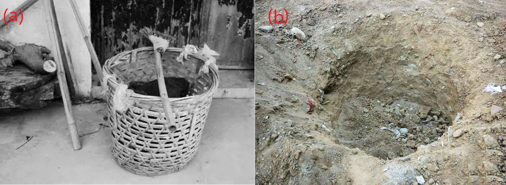{#fig:trashbinInOldTimes width=14cm height=6cm}

　　本世纪初期出现的简单分类垃圾桶，让我国人民开始得知垃圾分类的重要意义。分类垃圾桶由传统垃圾桶的一桶变化为多桶一体，并且可回收垃圾桶中收集的有价值可再利用的垃圾可以循环利用，减少了资源的浪费；有害垃圾桶内收集的废旧电池，部分含有重金属元素的电子垃圾，更是有效减少了危险有毒物质对于环境的破坏。近年来分类垃圾桶更是逐渐向着多功能，智能化发展。

　　如安装有太阳能电池和压缩机的CleanCUBE垃圾桶，其可通过太阳能电池提供的电力驱动压缩机压缩垃圾，使它可以吃下比一般垃圾桶多8倍的垃圾，如图{@fig:CleanCUBETrashBin}所示是CleanCUBE垃圾桶示意图；还有研究团队将传感器技术与压缩机共同用于垃圾桶，设计开发出了可以自主压缩、满溢提醒的智能垃圾桶[@Jin2010]，该垃圾桶还具有自动打包装袋垃圾的功能，方便使用的同时避免了人与垃圾的直接接触，十分卫生。压缩式的垃圾桶可以提高垃圾桶垃圾储量，减少工作人员清理的次数。

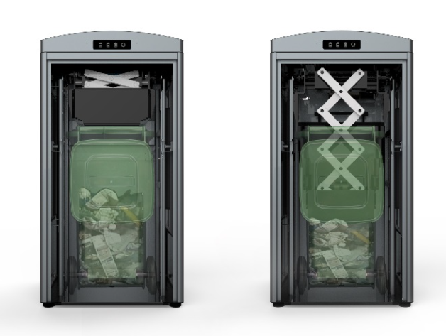{#fig:CleanCUBETrashBin width=14cm}

　　还有研究团队结合嵌入式技术和语音识别技术，开发出具有语音识别功能的智能垃圾桶，这类垃圾桶具有能够根据使用者的语音指令做出反应的能力。如根据人的指令移动到指定位置[@Su2019]、开启桶盖[@Zhang2017]以及结合深度学习技术和机器视觉技术设计的可以根据使用者念出垃圾类型进行智能分类的智能垃圾桶[@Guo2020; @Xie2018]。这些智能化的垃圾桶虽然具有较高级的功能，但是其使用性不足，如根据语音指令移动和开盖功能并非必要；基于语音或机器视觉的智能分类技术只能根据用户主动提供语音或图像信息才能实现分类。但是在城市社区的垃圾投递场景下，用户的垃圾一般被包裹在深色垃圾袋中，无法提供视觉信息；垃圾袋中垃圾较多时，提供垃圾类型语音信息也会占用使用者大量的时间，并不方便。

　　更有研究者另辟蹊径，设计研发出了基于机器视觉的自动垃圾分类分拣机器人系统[@chenzhihong2017]。这种机器人系统基于机器视觉技术和机器人技术，采用深度学习方法实现对复杂背景下垃圾对象的识别和定位，同时采用机械手进行垃圾的抓取和分拣。这一系统可以用于垃圾分拣中心，在垃圾分拣流水线上进行垃圾的自动化分拣。但是垃圾分拣有较多限制，如许多不易抓取的垃圾，就无法通过机器分拣实现分类。要从源头解决生活垃圾分类回收的问题，必须从智能化的垃圾桶入手。

### 国外研究现状

　　由于经济社会发展的不同，许多发达国家在垃圾分类方面走在我国前面。例如在德国、美国和日本，垃圾分类被立法支持，在比利时、罗马、奥地利等国，未分类的垃圾会被垃圾回收公司拒收且警告。在这些垃圾分类执行较好的国家，垃圾桶的发展自然也走在前列。

　　法国的初创公司Smartup Cities开发出了基于超声波传感器的垃圾桶内部填充水平的监测解决方案。可以将它安装在现有的垃圾桶上[@Filarski2020]，实现对垃圾桶内部垃圾量的远程监控，而且可以根据垃圾桶内垃圾量数据为城市管理部门规划最优的垃圾收集路线，图{@fig:SmartupCities}所示即使该产品安装在普通现有垃圾桶上。无独有偶，捷克斯洛伐克的Sensoneo公司也开发了一种垃圾桶容量的监测系统。不同的是，Sensoneo公司开发的系统可以适配多种传感器。并且具有更加复杂的软件服务，如数据智能分析，智能路线规划和垃圾信息管理系统等。除垃圾量监测外，总部位于澳大利亚的Smartsensor公司开发了一种利用温度传感器监测垃圾桶内温度的系统，该系统可以根据客户的需求制定一个警告阈值，当有垃圾桶内的温度超过该阈值时，系统可以通过短信或Email的形式通知管理人员。美国的EvoEco公司则更注重垃圾桶的人机交互系统，这家公司开发的EvoBin系统配备了屏幕、数据看板和其他交互系统，以吸引用户的注意力。例如，EvoBin的人机交互系统可以用电子游戏的元素来教育用户如何正确地进行垃圾分类，或者在用户丢弃垃圾后通过内置的传感器感测垃圾类型，并通过屏幕显示垃圾信息与用户交互，如图{@fig:EvoEco}所示。通过激发用户兴趣的方式达到自己的设计目的，不失为优秀的公共设施设计[@Li2012]。

{#fig:SmartupCities width=11.35cm}

{#fig:EvoEco width=14cm}

　　除工业企业外，也有大学和研究机构进行智能垃圾桶方向的探索。如印度印度拉贾斯坦邦NIIT大学计算机科学与技术学院的研究人员Jetendra Joshi等人提出的一个整合了物联网和无线传感器网络理念的垃圾桶网络[@joshi2016]，将无线传感器与云计算网络结合，实现了对社区垃圾桶容量的监测。同样来自印度的研究人员Kumar, N. Sathish等人则是利用Arduino UNO[@Martinez-Santos2017]硬件和Android技术实现了垃圾桶容量的监控，并在垃圾桶满溢时向市政府发出提醒，提高垃圾收集效率，避免了垃圾堆积造成的难闻气味和有害病菌。

　　综上所述，国内外学者以及工业企业在垃圾桶智能化方面做了许多研究，主要方向集中在以下几点：

#### 结合压缩机，实现垃圾桶的“扩容”，减少垃圾收集次数。
   
#### 结合无线传感网络或传感器，实现垃圾桶容量的监控和满溢警告，避免垃圾堆积。
   
#### 结合云计算和大数据技术，实现垃圾收集路线的自动规划，提高垃圾收集效率。
   
#### 结合深度学习技术，实现自动分类功能，帮助用户识别垃圾种类。
   
#### 结合优秀的人机交互设计，提高垃圾分类投递的趣味性，激励用户垃圾分类。
   
　　以上提到的垃圾桶部分已实际部署，但结合现实反馈，并非所有垃圾桶都具有好的效果。只有功能实用，使用方便，稳定性强的智能垃圾桶能够最终得到市场的认可。

## 本文主要工作

　　本文主要任务是设计一个适用于城市社区垃圾回收中心的城市智能物联网垃圾桶，以解决城市社区的垃圾分类难题。

　　首先，确定系统整体功能。通过文献调查法调查垃圾分类回收以及垃圾桶发展的社会背景和现状，了解了社会上垃圾分类面临的真正困难和问题；通过调研和资料的归纳整理，了解目前社会上已经出现的或已经部署使用的类似系统，研究其优点和缺陷，尤其是了解城市社区场景下智能垃圾桶运行所面临的问题和挑战。结合搜集整理的信息，进行系统整体功能的设计。

　　然后，从实际社会需求和问题出发，设计和开发一套多功能智能垃圾桶硬件控制终端，主要实现垃圾桶的智能控制和状态采集任务，解决社区垃圾分类设备设施不合理问题。通过调研传感器等器件确定系统器件选型，然后通过电路设计和嵌入式软件设计完成硬件电路的设计和实现。

　　最后通过垃圾桶信息化平台软件的设计，实现垃圾桶数据收集和持久化[@Yuan2020]以及用户认证积分系统，提高居民垃圾分类积极性。在垃圾桶端，首先需要设计一套可以采集垃圾桶控制终端数据并上传到云端的上位机系统，同时该上位机系统还需要具有一定的人机交互功能。在服务器方面，首先确定服务器硬件选型，确定服务端软件架构，随后针对本文提出的系统进行服务端软件的设计和开发。服务端软件的实现形成了上层数据应用的基础。通过Web技术实现的智慧城市垃圾桶信息化平台主要实现了城市垃圾桶状态信息可视化和垃圾桶异常提醒功能，解决了对城市社区垃圾桶的远程统一管理和高效垃圾回收问题。

## 论文组织方式

论文共分为六章：

　　第一章绪论，简述了本文的研究背景和意义，对课题所研究的城市物联网智能垃圾桶设计与应用的国家和地方政策以及现状进行了分析和概括。对国内外研究现状进行了调查和分析，介绍了其优点和存在的问题。最后介绍了本文主要的研究工作。

　　第二章系统总体方案，首先设计了系统的整体架构和各模块之间的关系；随后就各模块要实现的功能和接口分别进行研究。

　　第三章数据采集与控制终端设计与实现，首先研究终端系统的架构设计及硬件器件选型和电路，随后根据硬件电路的设计来设计和开发嵌入式软件的控制程序。

　　第四章垃圾桶信息化平台系统软件设计与实现，设计了垃圾桶信息化平台的整体架构，以及其主要构成部分：上位机软件部分和服务端软件部分。在上位机软件部分，主要研究上位机系统的整体架构、与终端系统的交互和数据采集模块、与服务端的交互和用户认证及数据上云模块等的设计。在服务端软件部分，首先进行服务端软件系统的硬件选型和架构设计，随后就各模块的功能设计和具体实现做分别研究。同时结合系统服务端获取的数据，利用数据处理和可视化技术可以构建城市社区垃圾桶的数字孪生体[@Gao2021; @Du2021; @Du2021a]，数据库中的用户信息可以用于构建垃圾分类积分激励系统，让分类意识深入人心。

　　第五章总结与展望，总结全篇内容并提出展望，结合本次设计的经验为城市智能垃圾桶的设计和发展方向起到借鉴作用。

# 系统总体方案

## 系统功能设计

　　本课题的目的是设计出一套智能的便于使用的城市社区垃圾桶系统，系统组成可分为智能垃圾桶终端系统、Android上位机系统、服务器后端系统和数据应用系统四个部分。主要实现以下几个功能：

#### 城市社区垃圾桶状态监控

　　通过智能垃圾桶终端的传感器实时监测和缓存垃圾桶内部状态信息，并通过Android上位机采集上传到服务器后端系统。服务端实时对来自各垃圾桶的状态数据进行渲染，实现城市社区垃圾桶的可视化监控。

#### 垃圾桶满溢及异常提醒

　　当有垃圾桶内部装满垃圾时，智能垃圾桶终端系统的桶满传感器会监测到这一状况并通过上位机上传到服务器。服务器后端系统分析到这一数据时便会向管理人员发送信息提醒对满溢垃圾桶进行清理回收。服务器后端系统会实时分析来自智能垃圾桶终端系统的温度传感器和可燃气体传感器的数据，根据桶内温度和可燃气体浓度推断发生火灾的可能性，当超过一定阈值时，系统会向管理人员发送警告，提醒其前往查看处理。

#### 人机交互

　　当用户通过智能垃圾桶终端的按键或Android上位机的触屏交互系统请求开启桶盖时，智能垃圾桶终端系统通过控制电动推杆实现垃圾桶盖的控制，方便用户使用。Android上位机系统会将其所管理的垃圾桶内部状态信息在其屏幕上渲染，让用户得知桶内状况。当垃圾桶已满或者内部状态异常时，会提醒用户且锁定桶盖。

#### 用户积分激励

　　用户投递垃圾时，可以使用身份ID进行认证登录，若投递的垃圾属于可回收垃圾，系统会计算用户投递的重量，并给与用户一定的积分奖励。用户的信息和积分数量信息存储在服务器后端系统的数据库中。

## 系统整体架构设计

　　为完成上节所提出的功能，系统的四个模块（智能垃圾桶终端、Android上位机、服务器后端和数据应用）需要完成的功能如下：

#### 智能垃圾桶终端

　　通过多种传感器实现垃圾桶状态信息的采集功能，通过嵌入式扫码器实现用户ID信息的录入，通过电动推杆实现桶盖的智能控制功能等。还需设计实现终端系统与上位机之间的交互接口，以实现数据的读出。

#### Android上位机

　　通过开发Android系统应用程序，实现对终端系统数据的读取和渲染功能，实现人机交互接口和服务端接入。当用户扫码登录时向服务端查询验证用户ID信息，并在用户投递后进行积分计算和上传。同时上位机系统以一定的时间间隔将垃圾桶的状态信息打包同步至服务器。

#### 服务器后端

　　通过合理的服务端软件设计实现分布式的智能垃圾桶上位机的数据同步和用户登录认证功能。服务端系统需要对大量部署的智能垃圾桶终端及Android上位机系统的数据上传做持久化处理，以及需要设计面向终端系统和数据应用系统请求的接口，实现对终端系统和数据应用系统请求的响应。

#### 数据应用

　　针对服务端采集到的大量数据和预留的接口，可以开发多种功能的数据应用，如智能管理平台、用户积分系统、数字孪生体、数据分析系统等。如智能管理平台可以实现对城市社区垃圾桶状态的实时监控和管理、异常警报、满溢提醒等。

　　本系统四个子模块之间的交互关系如下：

1. 智能垃圾桶终端与Android上位机之间的交互

　　智能垃圾桶终端部署在每个垃圾桶上，实时采集垃圾桶状态信息，等待用户操作，并将采集的信息缓存下来。每个Android上位机管理n个智能垃圾桶终端（n一般取4，可以在1~255之间任意扩展），相当于一组垃圾桶共用一个上位机系统。上位机通过485总线和MODBUS协议[@MODBUSStandard; @MODBUSStandard1; @Fovino2009; @Wu2021]将每个智能垃圾桶终端的状态数据采集汇总，在人机交互界面上渲染，同时以一定的频率向服务端同步。同时用户可以在上位机的界面上操作控制垃圾桶开盖。

2. Android上位机与服务器后端之间的交互

　　Android上位机以一定的频率将其采集的来自各垃圾桶的状态数据打包发送到服务端，由服务端系统对数据进行持久化处理。同时，通过服务器后端系统的接口，当用户通过垃圾桶的扫码器扫码时，Android上位机系统会把用户二维码ID发送至服务端进行查询认证，认证成功的用户才可以获得垃圾分类积分奖励。

3. 数据应用于服务器后端之间的交互

　　基于服务端数据库中存储的大量垃圾桶状态数据，通过服务端系统预留的接口，数据应用可以从服务端请求数据。对于某些系统（如管理系统）的某些操作（如删除操作），数据应用系统也可以改写服务端数据。

　　系统的整体架构图如{@fig:OverallStructure}所示：

{#fig:OverallStructure width=15.5cm}

## 小结

　　本章通过对系统需求的深入分析，对系统的功能方案进行了分析和设计。在功能方案的基础上，结合课题要求，分析整理了系统各子模块之间的交互逻辑关系。最后，根据模块交互关系和网络互联关系绘制了系统的整体架构图，形成了系统的整体设计方案，为系统的实现打下了基础。

# 数据采集与控制终端设计与实现

## 终端系统主要硬件电路设计与实现

### 终端系统硬件电路总体设计

　　系统硬件系统主要包括电源电路部分、单片机最小系统部分、传感器外设部分、桶盖控制部分，扫码器部分和上位机接口部分。其中传感器外设部分又可以分为温湿度传感器部分、重量传感器部分、桶满传感器部分、用户接近传感器部分和可燃气体传感器部分。硬件系统将终端系统的电源电路、单片机控制核心、传感器外设接口等部分集中在一块电路板上，可以显著减小系统的体积，更具适应性。图{@fig:HardwareStructure}所示为系统硬件电路架构设计图。

{#fig:HardwareStructure width=10cm}

　　该设计中，MCU（单片机）用于处理所有的传感器数据并与上位机通信；温湿度传感器、重量传感器、桶满状态传感器、可燃气体传感器用于检测垃圾桶内状态信息；用户接近模块和扫码器模块用于人机交互系统，提供更好的使用体验；上位机接口则用于与Android上位机通信。

### 终端系统单片机最小系统电路设计

　　出于成本和性能以及外设接口的丰富程度的综合考虑，本系统的单片机控制器选择意法半导体公司生产的STM32F103系列型微控制器。STM32F103系列微控制器基于Arm-Cortex-M3内核，主频最高为72MHz，内置Flash空间大小覆盖了从16KBytes到1MBytes的范围。根据内置Flash大小和RAM大小以及单片机针脚数量，STM32F103系列单片机可以分为如图{@fig:STM32F103Series}所示的29个型号。

{#fig:STM32F103Series width=16cm}

　　结合系统所需的外设种类和数量以及程序库编译后的二进制体积考虑，本设计选择了STM32F103RE系列单片机，它有64个引脚（其中51个是GPIO引脚，其余13个是电源，晶振等引脚），可以满足系统外设的连接控制需求；同时它内置了512KBytes大小的Flash和64KBytes大小的RAM，可以满足外设驱动和通信协议栈的程序运行。

　　由于本系统不需要在零下40摄氏度以下或85摄氏度以上的极端环境下工作，因此选定微控制器的型号为可在$-40℃~85℃$下工作的STM32F103RET6。

　　该型微控制器基础参数（局部）如表{@tbl:STM32F103RET6}所示[@Chong2020]：

| Flash大小 | SRAM大小 | Timer | SPI | I2C | U(S)ART | GPIO | 12位ADC |
| --------- | -------- | ----- | --- | --- | ------- | ---- | ------- |
| 512KB     | 64KB     | 8个   | 3个 | 2个 | 5个     | 51个 | 3个     |
Table:STM32F103RET6型微控制器基础参数表 {#tbl:STM32F103RET6}

　　可以看出该型微控制器的U(S)ART接口资源较为丰富，可以连接控制多个独立的串口设备。本系统所需的单片机最小系统电路与一般的STM32F103RET6系统别无二致，图{@fig:MCUCircute}所示是最小系统电路原理图。

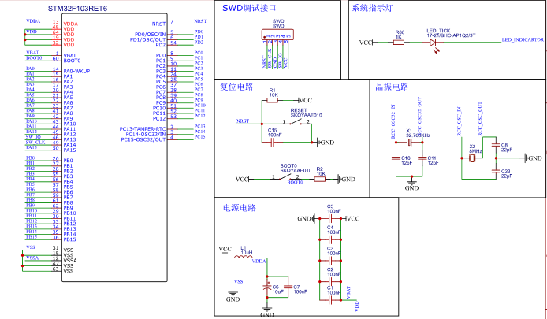{#fig:MCUCircute width=14cm}

　　该电路设计图中包含SWD调试接口、系统指示灯、复位电路、晶振电路、电源电路和MCU引脚等几个部分。

　　SWD调试即串行调试（Serial Wire Debug），是一种最少只需要占用单片机的2个引脚就可以实现内核访问调试的调试协议[@HuangYaPing2012; @HuangGuoWei2019; @Shi2020; @Shi2019]。使用SWD调试接口进行Arm-Cortex内核单片机的调试和程序下载，可以节约外设资源和减小电路板体积。

　　系统指示灯作为系统运行的指示，向系统维护人员传递系统仍在运行的信息。

　　复位电路由复位按键和上电复位电路[@Song2021]组成。STM32的单片机是低电平复位的，当上电时，STM32单片机的NSRT引脚电平为低时，单片机会将内部各寄存器的值重设为初始状态，随后NSRT引脚电平为高时，单片机正常工作，由此完成复位过程。复位电路上有电阻和电容构成的RC电路，这种RC电路可以时NRST引脚上的电压缓慢变化，防止电压突变造成故障。当单片机内部出现故障时，有时也需要对单片机进行复位，这时可以按下复位按键使NSRT引脚接地，完成复位[@Lu2014]。

　　晶振电路是控制器核心电路的核心[@Zhao2016; @Wang2012]，它本身是一种能够把电能和机械能相互转化的晶体，当它在共振条件下工作时，就可以提供稳定，精确的单频信号。通常情况下，普通晶振的频率可以达到百万分之五[@Wang2020]，精度极高。利用它所产生的时钟信号，可以为单片机提供时钟频率，从而驱动单片机的指令执行。

　　STM32F103RET6的电源分为芯片工作电压、ADC参考电压、模拟电压和电池备用电源等，分别对应单片机的11个（5种）引脚。其对应关系如表{@tbl:MCUPower}所示。

| VDD        | VSS        | VDDA       | VSSA       | V_BAT    |
| ---------- | ---------- | ---------- | ---------- | -------- |
| 工作正电压 | 工作负电压 | 模拟正电压 | 模拟负电压 | 电池供电 |
Table:STM32F103RET6单片机电源引脚种类 {#tbl:MCUPower}

### 终端系统温湿度传感模块电路设计

　　温湿度传感模块的一般设计思路是通过温度和湿度的传感器安装在垃圾桶内部来检测温湿度，本设计中为了结构的简约以及对节约单片机外设接口资源的考虑，使用温湿度一体传感器[@Lu2008]。现代的温湿度传感器根据原理的不同在结构上千差万别，根据测量对象、测量环境以及稳定性的考虑，本设计选用了YSAT01B型温湿度变送器作为温湿度传感模块的传感器。

　　该型温湿度传感器采用工业通用的RS485[@Xu2009; @FengZiLing2012; @Jia2010]总线和MODBUS协议，可以方便地通过串口进行通信。该型传感器可适配金属保护外壳，在垃圾桶场景下不易损坏。该型传感器技术参数如表{@tbl:TempSensorTable}所示。

| 参数名称     | 参数值                        |
| ------------ | ----------------------------- |
| 温度测量范围 | $-30^oC~80^oC$                |
| 温度测量精度 | $\pm0.3^oC(at 25^oC)$         |
| 湿度测量范围 | $0~100RH\%$                   |
| 湿度测量精度 | $\pm 3RH\%$                   |
| 通讯接口     | $RS485(MODBUS-RTU)$           |
| 供电电源     | $DC5~24V$                     |
| 分辨率       | 温度$0.01^oC$，湿度$0.01RH\%$ |
| 功耗         | $\leqslant 0.1W$              |
| 运行环境     | $-40^oC~120^oC,0~100RH\%$     |
Table:YSAT01B型温湿度变送器技术参数 {#tbl:TempSensorTable}

　　容易看出，该型传感器适用于本系统所工作的场景，且精度较高。图{@fig:TempSensorImage}所示是该型传感器的外形示意图。

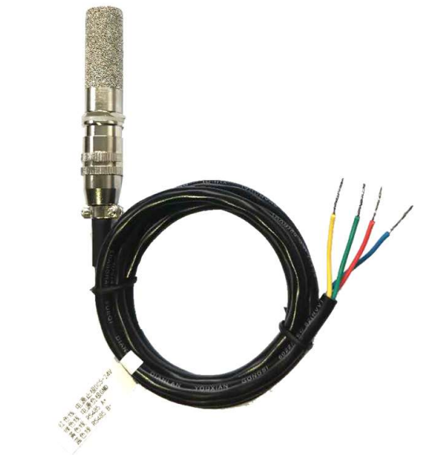{#fig:TempSensorImage width=11.35cm}

　　传感器有四条引脚接线，分别是电源正负极和RS485总线的AB差分线。根据此接口，设计传感器与单片机控制器之间的接口电路原理如图{@fig:TempSensorCircute}所示。

{#fig:TempSensorCircute width=16cm}

　　由于单片机的外设接口只有U(S)ART串口，不具有直接输出485差分信号的能力。本模块采用MAX3485ESA（图{@fig:TempSensorCircute}中的U9）实现了一个485与UART电平互转的电路[@Lei2014]，实现了单片机与传感器之间的通信，在单片机端，选择USART1串口作为温湿度通信串口。同时该部分电路设计有串口收发指示灯，用以提示维护人员该传感器与单片机之间的通信情况。

### 终端系统重量传感模块电路设计

　　在垃圾桶使用场景中，如果只依靠桶满传感器传感桶内垃圾容量，有时会出现“虚满”的现象。这是因为垃圾桶内部的垃圾可能存在许多蓬松的体积大（且可折叠压下）的垃圾。为了避免虚满对垃圾回收清理效率的影响，本设计采取桶满传感器与重量传感器结合的方式判断垃圾桶内剩余容量。当桶满传感器报告垃圾桶已满时，系统还要结合重量信息判断桶内是否出现了虚满现象。这样就可以避免系统出现误判。

　　考虑到使用场景中环境可能较为潮湿且重量较大，本设计选用常用于工业场景的悬臂梁式称重传感器[@Bi2020; @Gong2019; @Jin2014]实现对垃圾桶重量的传感。这种传感器的工作原理是惠斯通电桥[@Jin2020]，悬臂的应变区贴有应变片，可以感应到微小应变，并以电阻变化的形式表现，惠斯通电桥的四个桥即应变片。

　　该型传感器的技术参数和安装示意分别如表{@tbl:WeightATbl}和图{@fig:WeightAFig}所示。

| 参数名称       | 参数值             | 参数名称     | 参数值                      |
| -------------- | ------------------ | ------------ | --------------------------- |
| 量程           | $0~500kg$          | 零点温度漂移 | $0.03\%F.S./10^oC$          |
| 输出灵敏度     | $2.0\pm0.05V/mV$   | 材质         | 铝合金                      |
| 零点输出       | $\pm1\%F.S.$       | 阻抗         | $350\Omega$                 |
| 非线性         | $0.02\%F.S.$       | 绝缘电阻     | $\geqslant5000M\Omega/100V$ |
| 滞后           | $0.03\%F.S.$       | 电压         | $5~15V$                     |
| 重复性         | $0.02\%F.S.$       | 工作温度     | $-20^oC~80^oC$              |
| 蠕变（30分钟） | $0.03\%F.S.$       | 安全超载     | $150\%$                     |
| 温度灵敏度漂移 | $0.03\%F.S./10^oC$ | 极限超载     | $200\%$                     |
Table:悬臂梁式称重传感器的典型技术参数和电气特性 {#tbl:WeightATbl}

{#fig:WeightAFig width=11.35cm}

　　由于单片机内部只有12位的ADC，其模拟信号测量精度最高只有$1/2^{12}V$，不足以满足设计需要。因此，本设计使用KYD-310式数字变送器采集称重传感器的模拟信号转化为数字量供单片机查询。这样控制系统的电路设计和软件设计不许考虑传感器细节，可以直接通过接口查询结果，简化了系统设计，实现了控制系统和外设传感器的解耦分离。表{@tbl:WeightDTbl}所示是KYD-310式数字变送器的技术规格。

| 参数名称       | 参数值                |
| -------------- | --------------------- |
| 供电电压       | $10V~30V$             |
| 输入灵敏度     | $0.4mV/V-6mV/V$       |
| 传感器激励电压 | $5V\pm2\%$            |
| A/D参数        | 24位，Delta-Sigma方法 |
| 通信接口       | RS485(MODBUS-RTU)     |
| 精度           | 1/10000               |
| 工作温度       | $-30^oC~60^oC$        |
| 防护等级       | IP64                  |
Table:KYD-310型数字变送器技术规格 {#tbl:WeightDTbl}

　　由于与单片机直接通信的数字变送器采用RS485接口收发数据，所以单片机核心控制板上只需留有485和U(S)ART电平互转电路和接口即可，用于通信的片上外设选择的是USART3。此模块电路原理图与图{@fig:TempSensorCircute}极为相似，此处不赘附。

### 终端系统桶满状态传感模块电路设计

　　对于垃圾高度信息，系统只需关心桶内垃圾是否已满，对于具体的高度数值无需详细采集。因此桶内垃圾高度采用E3F-DS30C4型红外接近开关采集，该型传感器可视为一种开关，其在被测表面距离较远时处于常开状态，此时公共端与常开端短路，在被测表面对传感器造成遮挡时处于常闭状态，此时公共端与常闭端短路。电路原理图如图{@fig:FullCircute}所示。

{#fig:FullCircute width=5cm}

　　该电路原理图设计中，红外接近开关的输出信号首先经过电阻分压后才接入单片机的PA8引脚，分压比例为$V_{out} = V_{in}\times \frac{3.3}{5.3}$，可以保护单片机免遭过高电压的冲击而损坏。

### 终端系统用户接近传感模块电路设计

　　用户接近传感实际是在测量桶前方用户相距垃圾桶的距离，常用的距离检测方案式采用超声波测距传感器。考虑到超声波传感器的测距角度广、分辨率高以及结构简单可靠的特点[@Chen2021; @Wang2021]，本设计也选用超声波测距传感器进行用户接近的传感。所选用的超声传感器探头与常见的倒车雷达所使用的超声波传感器别无二致，其外观示意图如图{@fig:UltrasoundFig}所示。

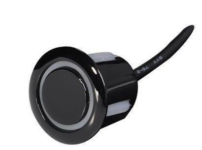{#fig:UltrasoundFig width=6cm}

　　该传感器探头需要一定频率的信号才可以驱动，其反馈回的信号也是模拟信号，需要进一步标定才能转换为距离数值，较为复杂，因此，本设计使用了一个AJ-SRO4M-TX驱动模块来辅助完成超声波测距的任务，该模块的外观如图{@fig:AJ-SRO4M-TX}所示。

{#fig:AJ-SRO4M-TX width=8cm}

　　该模块的数据通过标准的UART串口进行输出，因此此模块的接口电路不需要其他电平转换电路来适配，可以直接与单片机的UART4外设接口连接。用户接近传感模块电路原理图如图{@fig:AJ-SRO4M-TXCircute}所示。

{#fig:AJ-SRO4M-TXCircute width=8cm}

### 终端系统可燃气体浓度传感模块电路设计

　　在厨余垃圾桶中，由于餐厨垃圾较多，如果较长时间不清理，可能会产生一定浓度的沼气等可燃气体[@Hao; @Yang2021]，带来爆炸或燃烧的危险，其他的垃圾桶有时也存在这样的危险。为了获取垃圾桶内的可燃气体浓度，本设计使用了MQ-2可燃气体传感器作为可燃气体传感模块的传感器。

　　MQ-2型可燃气体传感器的原理是使用在清洁空气中电导率较低的二氧化锡（化学式：$SnO_2$）材料，这种材料处在含有可燃气体浓度较高的气体中时，其电导率会随可燃气体浓度的增加而增大[@Zhang2021; @Zhang2019]，该型传感器的技术参数如表{@tbl:MQ-2SensorTbl}。因此可以使用简单的电路测量材料的电导率（电阻）获知空气中的可燃气体浓度。如图{@fig:MQ-2SensorFig}所示是该型传感器外形示意图和电路原理图，图中(a)是传感器外观示意图，(b)是电路原理图，该电路设计输出的信号是一个模拟信号，使用单片机的ADC1通道4进行采集。

| 参数名称         | 参数值                                        |
| ---------------- | --------------------------------------------- |
| 可燃气体检测浓度 | $300~10000ppm$                                |
| 灵敏度           | $Rs(空气中)/Rs(2000ppm C_3H_8中) \geqslant 5$ |
| 输出电压         | $2.5V-4.0V$                                   |
| 浓度斜率         | $\leqslant 0.6$                               |
Table:MQ-2型可燃气体浓度传感器技术参数表 {#tbl:MQ-2SensorTbl}

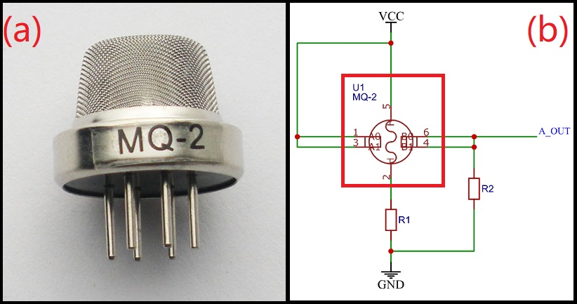{#fig:MQ-2SensorFig width=12cm}

### 终端系统桶盖控制模块电路设计

　　作为智能化的垃圾桶，应当做到良好的使用体验。本设计考虑到用户直接接触垃圾桶可能造成手部的污染，设计了一个桶盖智能控制模块，用户可不接触桶盖就可开关桶盖。作为桶盖控制模块的动力部分，其结构需尽可能简单以获得足够的可靠性。本设计采用一个电动推杆作为开关桶盖的动力来源，响应速度快，可靠性强。

　　电动推杆的驱动原理是利用直流电机配合螺杆驱动内管伸出或缩回，一个典型的电动推杆结构图如图{@fig:PutterFig}所示。

{#fig:PutterFig width=12cm}

　　由于电动推杆依靠直流电机驱动，它的控制也十分简单：以24V电压的推杆为例，在推杆的电源上接入+24V，推杆伸出；接入-24V，推杆缩回。因此可以使用GPIO控制继电器电路对该直流电机进行控制，本设计中选择的GPIO为PC9，原理示意图如图{@fig:PutterControl}所示。

{#fig:PutterControl width=12cm}

　　为防止因推杆故障或机械故障导致系统无法确定桶盖状态，本设计使用了一个限位开关实现桶盖状态的反馈。限位开关可安装在桶盖与桶身直接接触的地方，需实现桶盖的开启状态与关闭状态下限位开关的状态不同。如此，便可以通过限位开关的状态获知桶盖的实际状态。

### 终端系统扫码器模块电路设计

　　扫码器采用的是ES4650嵌入式影像扫描器，该型扫码器可以快速扫描解码多种一维码、二维码，支持识别手机屏幕等高反射率表面上显示的条码，适用于复杂影像光照环境。该型扫码器还具有自动感应功能，可以在其视野范围内出现物体时自动开始扫描解码。该型扫码器的技术参数如表{@tbl:ScannerTbl}所示，外观如图{@fig:ScannerFig}所示。

| 参数名称 | 参数值                                    |
| -------- | ----------------------------------------- |
| 输入电压 | $3.4-5.5V DC$                             |
| 电流     | $105mA(待机)，435mA(扫描)@5VDC$           |
| 视场角度 | 水平：$45^o$，垂直：$28^o$                |
| 扫描角度 | 左右$\pm70^o$，上下$\pm72^o$，旋转$360^o$ |
| 温度范围 | $-20^oC-50^oC$                            |
| 湿度范围 | $5\%-95\%(无冷凝)$                        |
| 解码种类 | 10余种二维码，25种条形码                  |
| 通信接口 | RS-232串口，3.3V TTL 电平                 |
Table:ES4650嵌入式影像扫描器参数表 {#tbl:ScannerTbl}

{#fig:ScannerFig width=7cm height=4cm}

　　该型扫码器的通信接口采用RS-232串口[@Yan2020; @Xi2020]进行通信，因此在核心控制板上需要集成一个RS-232和UART电平互转模块。本设计使用SP3232EIM电平互转芯片实现RS-232与UART之间的电平互转，该模块选择的串口为USART2，该芯片在3.3V或5V供电时均可工作，可以保证速率为$250kbits/s$的通信速率，被广泛应用于个人电脑、调制解调器等通信场景。本设计的扫码器模块接口电路原理图如图{@fig:ScannerCircute}所示。

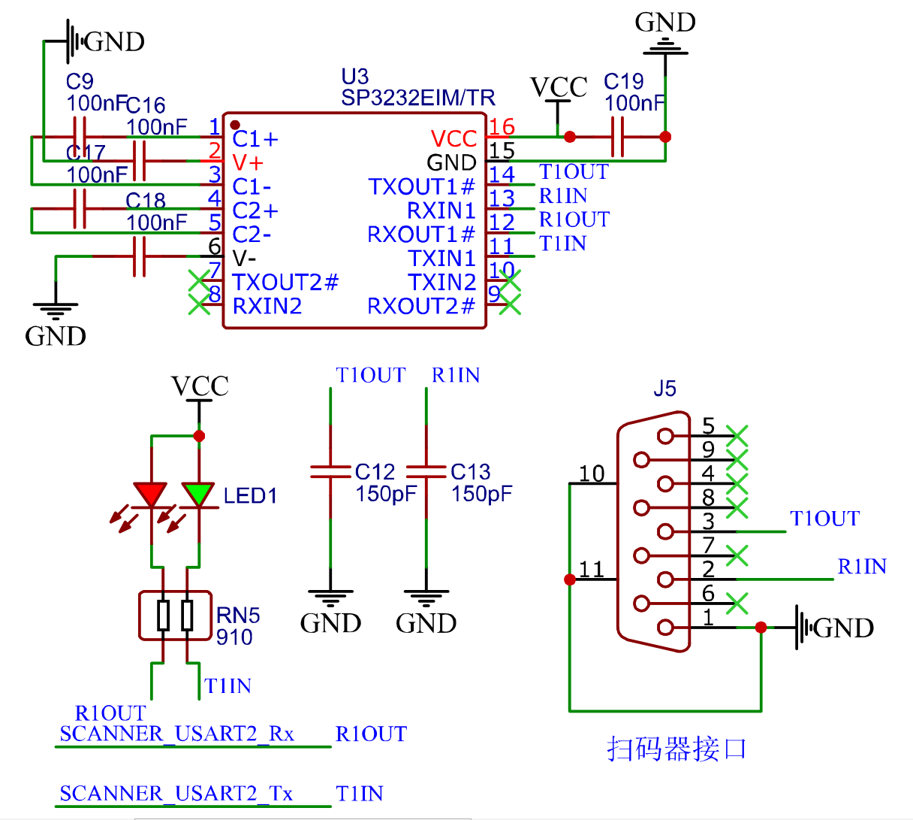{#fig:ScannerCircute width=12cm}

### 终端系统上位机接口部分电路设计

　　根据设计方案，垃圾桶端系统架构应为一台上位机控制多台垃圾桶分控终端。要实现该架构，上位机与垃圾桶分控终端之间就必须采用总线式连接进行通信，常见的通信接口如CAN[@Kan2021]，485[@Chen2021]等都是总线式通信接口，其中485总线因稳定性高、传输距离远[@Xu2009]而常用于工业自动化控制领域，本设计中的单片机和上位机之间的通信接口也采用485总线接口。在分控终端电路上，仍需要一个485与UART电平互转的电路实现单片机端的485通信，电路原理图仍与图{@fig:TempSensorCircute}所示电路十分相似；在Android上位机端，可以采用USB-485互转电路实现Android上位机与分控终端之间的485通信，单片机端实现通信的串口使用的是UART5。

　　本设计使用的USB-485互转电路如图{@fig:USBTo485}所示。

{#fig:USBTo485 width=14cm}

### 终端系统硬件电路实现

　　根据以上（3.1.1节至3.3.10节）所述，设计了垃圾桶终端系统的各模块硬件电路原理图，并结合EDA（电子设计自动化）软件工具和电气电子元件封装库，进行了PCB的设计。垃圾桶终端系统的硬件电路PCB设计图如图{@fig:PCB}所示，其中（a）为PCB的顶层，（b）为PCB的底层。

{#fig:PCB width=16cm}

　　根据此PCB设计图，制作的PCB电路板实物如图{@fig:PCBBoard}所示，图中（a）部分对应PCB设计图中的顶层，（b）对应设计图的底层。电路板的制作完成为下文的终端软件设计打下了基础。

{#fig:PCBBoard width=16cm height=8cm}

## 终端系统软件设计与实现

### 终端系统软件整体架构

　　根据系统硬件的设计，系统软件主要需要完成以下几个任务：

#### 采集来自传感器的数据

　　对于系统硬件系统使用的温湿度传感器、重量传感器、桶满传感器、超声波传感器、可燃气体浓度传感器等外设，其数据需要系统软件查询接收才可以正确驱动。收到数据后，系统还需要对数据进行解码以获得传感器感测的数值。

#### 对扫码器扫描二维码作出响应

　　由于用户扫码操作并非时刻进行，当没有用户扫码时，系统不需与扫码器通信；当用户扫码时，系统需要及时接受来自扫码器的数据并解码存储在RAM中。

#### 当用户请求时，控制桶盖开启

　　当有用户求情开盖时，系统首先判断当前垃圾桶内是否存在不适宜开盖的异常状况，然后决定是否通过操作GPIO引脚的电平变化控制继电器进而控制电动推杆的开合。

#### 响应来自上位机的通信请求

　　上位机通过485总线和MODBUS协议与本终端系统进行通信，系统需要接收来自上位机的通信数据并作为MODBUS从机做出响应。

　　结合上述软件系统需要完成的任务和硬件系统的设计，确定软件系统的架构如图{@fig:SoftwareStructureFig}所示。

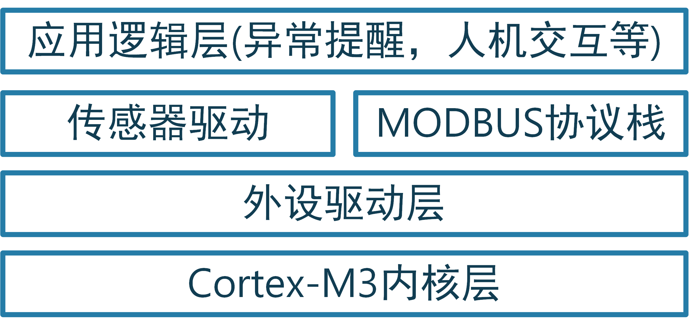{#fig:SoftwareStructureFig width=11cm}

　　Cortex-M3核心层是Cortex-M3内核及设备的抽象描述代码，它主要管理内核寄存器以及内部存储空间、外设寄存器等资源，同时，核心固件层的程序对MCU硬件的寄存器进行了统一的命名管理，屏蔽了硬件细节，使得对于任何使用同样内核的单片机都可以以同样的方法来操作寄存器。一般情况下，内核代码由芯片的制造厂商提供，或由第三方根据内核标准实现。

　　外设驱动层即对U(S)ART、SPI、IIC、Timer等各种外设进行管理的符合Cortex微控制器软件接口标准（Cortex Microcontroller Software Interface Standard，CMSIS）[@Wang2020a; @Hao2018]的函数库，该层的程序将MCU的外设寄存器操作封装成统一的函数接口，在核心固件层的基础上进一步抽象为用户屏蔽了底层的寄存器细节，使得应用层对于同一外设的操作统一了起来。STM32芯片外设库尚未发展到今天的程度之前，工程师们要开发一个应用，就必须查询参考手册直接操作繁杂众多的寄存器。在行业的不断发展下，现在已经有了许多优秀的外设驱动库实现，如标准外设库（Standard Peripheral Libraries， SPL）、硬件抽象层（Hardware Abstraction Layer，HAL）、底层应用程序接口（Low Layer APIs，LL）和其他的一些第三方实现的函数库。SPL、HAL和LL中，SPL是较早期的实现，由于其在不同型号单片机上的实现并不兼容，因此使用SPL开发的程序并不具有可移植性，目前也在被慢慢淘汰；HAL和LL是较为先进的外设库实现，出于工程化的考虑，它们为不同单片机的外设抽象封装了相同的接口，使得相同的上层外设操作代码可以跨越几乎所有的STM32单片机使用。相比于HAL库，LL库封抽象层次更低，往往是对寄存器操作的简单封装，更接近硬件，因而具有更高的性能表现，也是发布较晚，设计理念较为先进的函数库，因此，本系统的软件实现采用LL库作为外设驱动层。SPL、HAL和LL之间的关系如图{@fig:Libraries}所示。

{#fig:Libraries width=12cm}

　　传感器驱动和MODBUS协议栈是应用层程序的一部分，传感器驱动负责管理不同的传感器，为其分别编写操作传感器的接口函数，使上层的应用逻辑开发不必关心传感器的接口等细节；MODBUS协议栈则是为了与上位机之间进行通信而使用的，它作为一个独立的部分管理系统与上位机之间的信息交换。

　　应用逻辑层主要通过调用传感器驱动函数获取传感器感测数据，基于获取的数据进行上层逻辑开发。例如对传感器数据进行滤波处理、对异常数据进行提醒等。同时应用逻辑层也会调用MODBUS协议栈暴露出的接口，例如向协议栈同步最新的传感器数据、从协议栈获取上位机发出的指令等。

### 终端系统温湿度传感模块软件设计

#### 温湿度传感模块驱动设计

　　根据系统硬件的设计，温湿度传感器通过一个485-UART电平互转模块与单片机的USART1串口通信。因此使用此传感器之前需要对单片机的USART1串口进行初始化操作，因为本设计中的所有传感器外设都使用了DMA技术进行外设寄存器与内部RAM之间的数据传递，因此在初始化阶段主要需要对外设的DMA控制器进行初始化。

　　同时该型温湿度传感器的通信协议是MODBUS，其内部的寄存器分配如表{@tbl:TempAddrTbl}所示。

| 寄存器地址 | 寄存器数量 | 寄存器说明 | 读写限制 |
| ---------- | ---------- | ---------- | -------- |
| 0x0000     | 1          | 温度寄存器 | 只读     |
| 0x0001     | 1          | 湿度寄存器 | 只读     |
| 0x0064     | 1          | 型号编码   | 读/写    |
| 0x0065     | 1          | 测点总数   | 读/写    |
| 0x0066     | 1          | 设备地址   | 读/写    |
| 0x0067     | 1          | 波特率     | 读/写    |
Table:温湿度传感器MODBUS协议数据地址表 {#tbl:TempAddrTbl}

　　根据此表和MODBUS报文帧格式[@MODBUSStandard1]，可以推算出读取或改写各数据的指令。结合推算出的指令和外设库中的串口操作函数，可以设计出温湿度传感器的驱动函数库。取最为常用的读取温湿度函数为例，其查询指令为`0x01, 0x03, 0x00, 0x00, 0x00, 0x02, 0xC4, 0x0B`，此指令发送后在串口接收中断中收到的数据即温湿度传感器的返回数据帧，根据MODBUS协议规定的报文返回帧格式[@MODBUSStandard1]和表{@tbl:TempAddrTbl}中的寄存器分配关系，可以解析返回数据帧以获取查询的数据。

　　在查询时，程序首先清除DMA的TC3标志位，然后将要发送的数据拷贝到发送缓冲区，最后重新使能DMA通道，DMA即自动进行数据的转移；接收时，DMA会自动将串口外设的接收寄存器中的数据运送到接收缓冲区，因此在处理函数中，可以直接读取使用接收缓冲区中的数据。

#### 温湿度传感模块驱动调用流程

　　根据上节中的传感器驱动设计，温湿度传感模块函数在整个系统中的调用流程如图{@fig:TempProcess}所示。

{#fig:TempProcess width=5cm}

　　在初始化阶段，系统需要先进行内核时钟、核心资源以及外设的初始化过程，为传感器驱动的正确执行打下基础；在实际使用传感器的应用逻辑阶段，程序首先要进行传感器的初始化，然后根据逻辑需要调用输出查询和接收函数。

### 终端系统重量传感模块软件设计

#### 重量传感模块驱动设计

　　与温湿度传感模块类似，重量传感模块与单片机之间也是通过485总线和MODBUS协议进行通信。因此，重量传感模块驱动函数与温湿度传感器的驱动函数十分相似。只需把温湿度传感器初始化函数中的串口号、DMA相关硬件编号以及缓冲区等参数换成称重传感模块对应的参数，即可实现对称重传感模块的初始化。

　　在传感器的查询及写入操作方面，根据表{@tbl:WeightTbl}所示的数据地址表，同样可以推算出各数据的查询指令。

| 寄存器地址 | 寄存器数量 | 寄存器说明   | 读写限制 |
| ---------- | ---------- | ------------ | -------- |
| 0x0050     | 2          | 重量数据     | 只读     |
| 0x005D     | 1          | 手动清零范围 | 读/写    |
| 0x005E     | 1          | 执行手动清零 | 只写     |
Table:重量传感模块MODBUS协议数据地址表 {#tbl:WeightTbl}

　　根据此表，可以用与温湿度传感器极为相似的过程向传感器查询数据，只需把指令换为重量传感器的指令，同时更换串口相关的参数。以最常用的重量数据读取为例，其指令为`{0x01, 0x03, 0x00, 0x50, 0x00, 0x02, 0xC4, 0x1A}`。同样的，在串口的DMA中断发生时，可以直接调用数据接收函数对接收缓冲区中的数据进行解析处理。

#### 重量传感模块驱动调用流程

　　同样的，驱动函数调用过程也如图{@fig:TempProcess}所示。

### 终端系统桶满状态传感模块软件设计

#### 桶满状态传感模块驱动设计

　　根据系统硬件设计，桶满状态传感模块通过红外接近开关采集，红外接近开关的输出连接到单片机的PA8引脚上，只需采集这个引脚上的电平状态，即可获取垃圾桶内部的桶满状态。

#### 桶满状态传感模块驱动调用流程

　　对于GPIO的操作流程较为简单，外设方面只需要初始化PA8引脚为输入模式就可以调用驱动函数对引脚电平进行采集。该模块驱动函数调用流程如图{@fig:FullProcess}所示。

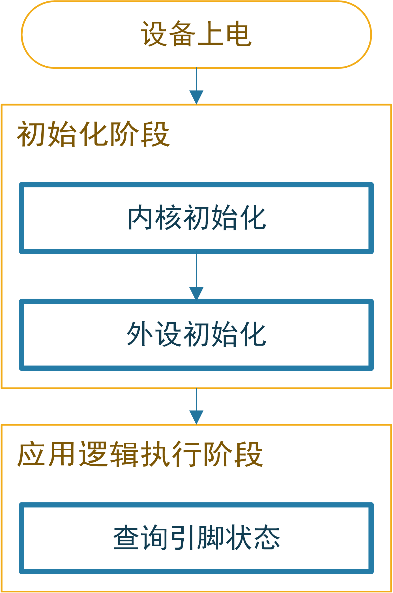{#fig:FullProcess width=5cm}

### 终端系统用户接近传感模块软件设计

#### 用户接近传感模块驱动设计

　　用户接近传感模块的硬件设计使用了一个超声波传感探头和AJ-SRO4M-TX超声波探头驱动模块。该驱动模块可以配置成串口自动模式，即该模块以一定的频率主动通过串口发出超声波测距数值。因此，该传感模块的驱动程序不需要额外的数据查询操作，只需要完成单片机的串口外设初始化即可。

#### 用户接近传感模块驱动调用流程

　　超声波传感模块驱动的使用较为简单，只需在完成串口UART4的初始化之后再调用模块的初始化函数，即可实现数据自动接收到数据缓冲区。驱动函数的调用流程如图{@fig:UltrasoundProcess}所示。

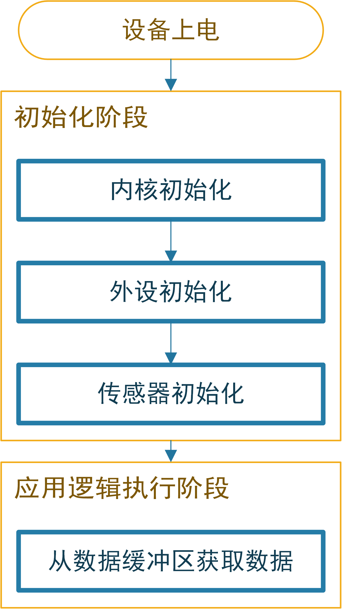{#fig:UltrasoundProcess width=5cm}

### 终端系统可燃气体浓度传感模块软件设计

#### 可燃气体浓度传感模块驱动设计

　　可燃气体浓度传感模块输出一个与甲烷等可燃性气体浓度正相关的模拟信号，在硬件设计中，该传感器的输出信号通过单片机的ADC1通道4进行检测。在程序中，首先进行ADC外设的初始化，随后只需要将该ADC通道的DMA设置为循环模式（Circular Mode），单片机的ADC硬件就会不断地根据预先设定的参数进行模拟信号的采集。因此，本模块的驱动函数也十分简单，只需要完成对传感器的初始化，无需额外的数据查询函数。

　　同样地，该传感器驱动函数的调用流程也如图{@fig:UltrasoundProcess}所示。

### 终端系统桶盖控制模块软件设计

#### 桶盖控制模块驱动设计

　　桶盖使用电动推杆控制。在硬件上，推杆由单片机的引脚电平通过继电器模块进行控制。根据桶盖的“开”和“关”两种状态，桶盖控制模块的驱动函数主要有两个，分别控制桶盖开启和关闭。

　　在开启函数中，首先需要检测垃圾桶状态，判断垃圾桶内是否存在三种情况中的至少一种：1. 桶内温度过高；2. 桶内已满；3. 桶内垃圾重量超重，如果存在，则不执行开盖命令，反之进行下一步检查。在下一步检查中，系统通过限位器引脚电平判断桶盖状态，如果桶盖已经打开，则不执行命令。

#### 桶盖控制模块驱动调用流程

　　驱动函数调用之前，必须保证控制引脚已经初始化为输出模式，限位器引脚已经初始化为输入模式。驱动函数调用流程如图{@fig:PutterProcess}所示。

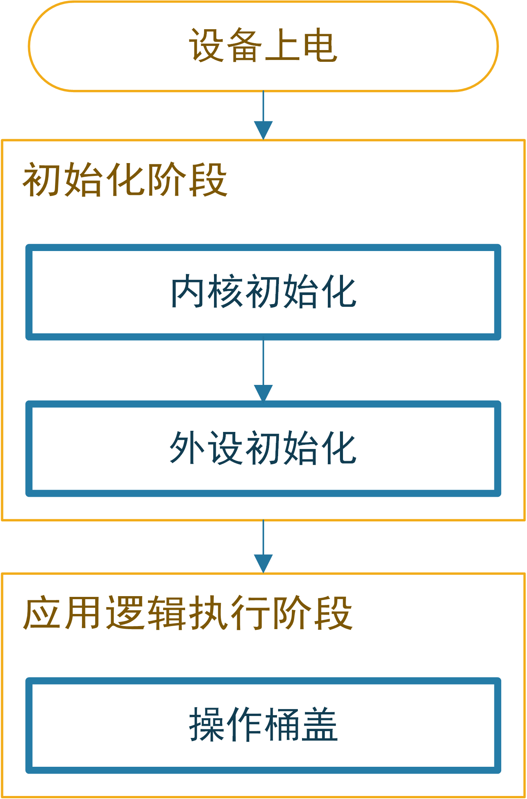{#fig:PutterProcess width=5cm}

### 终端系统Modbus协议栈设计

　　为了实现多台智能垃圾桶控制终端与上位机之间的通信，本设计采用485总线和MODBUS总线式通信协议。每台控制终端作为MODBUS协议中的一个从机设备，每个传感器数据作为从机设备中的一个数据寄存器供主机（上位机）查询。由于协议需要通过一个串口硬件实现数据的收发，本设计采用单片机的UART5串口作为MODBUS协议栈的硬件串口；同时协议需要一个硬件定时器作为计时基准以实现通信过程中的精确时序控制，本设计使用单片机的TIM6定时器作为协议栈定时器。

#### 协议栈初始化

　　在协议栈的初始化过程，首先需要初始化使用的TIM6和UART5硬件资源，将其配置成指定的参数并使能。随后配置MODBUS协议栈的模式、设备地址、串口号、波特率等参数，完成后即可使能协议栈在主循环中监听总线请求。

　　值得注意的是，本设计使用了一个拨码开关实现协议栈设备地址的现场维护，维护人员通过波动拨码开关即可调整控制终端的设备地址，不需要复杂的上位机软件，提高了维护效率。拨码开关为四位，采用拉高设计，分别连接到单片机的四个输入引脚上。在软件系统的初始化阶段，系统读取这四个引脚上的电平并进行二进制解码，以解码得到的数据作为设备的地址。

#### 数据地址分配

　　在MODBUS协议栈，数据被存储的位置被称为“寄存器”。因此，数据的地址分配即寄存器的分配，MODBUS协议总共定义了输入寄存器（只读），保持寄存器（读写），线圈（读写）等多种数据模型，在本设计中，考虑各传感器数据应该是只读的，将其放在输入寄存器中；对于桶盖状态数据，其应该是可以控制改写的，且其宽度只有一位，故放在线圈寄存器中。本设计中协议栈内部数据分配如表{@tbl:MODBUSTbl}所示。

| 外设类型         | 寄存器类型 | 数据地址 | 数据长度 |
| ---------------- | ---------- | -------- | -------- |
| 温度数据         | 输入寄存器 | 0x00     | 1        |
| 湿度数据         | 输入寄存器 | 0x01     | 1        |
| 可燃气体浓度数据 | 输入寄存器 | 0x02     | 1        |
| 重量数据         | 输入寄存器 | 0x03     | 2        |
| 用户ID信息       | 输入寄存器 | 0x05     | 14       |
| 超声波测距数据   | 输入寄存器 | 0x12     | 1        |
| 桶满状态数据     | 输入寄存器 | 0x14     | 1        |
| 桶盖开合状态     | 线圈       | 0x00     | 1        |
Table:协议栈内部数据地址分配 {#tbl:MODBUSTbl}

#### 通信接口

　　根据表{@tbl:MODBUSTbl}所提出的数据地址分配，可以根据MODBUS协议报文帧格式推算出上位机查询和改写主要数据的接口如表{@tbl:MODBUSInterfaceTbl}所示（设备地址取`0x01`）。

| 指令                      | 描述               |
| ------------------------- | ------------------ |
| `01 04 00 00 00 01 31 CA` | 读取温度           |
| `01 04 00 01 00 01 60 0A` | 读取湿度           |
| `01 04 00 02 00 01 90 0A` | 读取可燃气体浓度   |
| `01 04 00 03 00 02 81 CB` | 读取重量           |
| `01 04 00 06 00 0D D1 CE` | 读取用户ID         |
| `01 04 00 13 00 01 C0 0F` | 读取超声波测距数据 |
| `01 04 00 14 00 01 71 CE` | 读取桶满状态       |
| `01 01 00 00 00 01 FD CA` | 读取桶盖状态       |
| `01 05 00 00 FF 00 8C 3A` | 开启桶盖           |
| `01 05 00 00 00 00 CD CA` | 关闭桶盖           |
Table:控制终端MODBUS通讯接口 {#tbl:MODBUSInterfaceTbl}

　　通过该表所示的接口，上位机只需通过485总线向从机终端发送指令，即可获取或改写系统内部的数据。

### 终端系统软件实现

　　根据以上（3.2.2节至3.2.7节）所述之传感器驱动函数设计以及3.2.8节所述数据地址分配，结合3.2.1节提出的使用LL外设库的设计。在STM32CubeMX（Version 6.2.1）软件中对软件系统的外设参数、时钟参数、外设预定义等进行了设置，生成了用Makefile[@Cheng2020; @Gu2016]组织的工程框架代码。然后使用VSCODE编辑器和gcc-arm工具链进行上层逻辑的编写和开发。

　　在上层逻辑方面，主要有两个部分：1. 传感器数据采集；2. 用户操作响应和异常数据提醒。

#### 传感器数据采集

　　在传感器数据采集方面，由于本设计中使用了多种需要发送指令以查询数据的传感器外设（如温湿度、重量传感器），为了不让发送查询指令的操作占用主循环的时间，本设计使用了一个硬件定时器来定时进行所有传感器数据查询指令的发送。首先将定时器初始化，然后定时为100ms，随后就可以在定时器的中断函数中调用数据查询函数。这种结构的好处是它相当于将指令发送操作放在另外一个线程中进行，提高了CPU效率。

　　设计中还使用了不需要指令查询的传感器，对于这些传感器，其数据是自动采集的，使用时可直接取用，因此不需要额外的数据采集代码。传感器数据采集部分的软件流程如图{@fig:SensorProcess}所示。

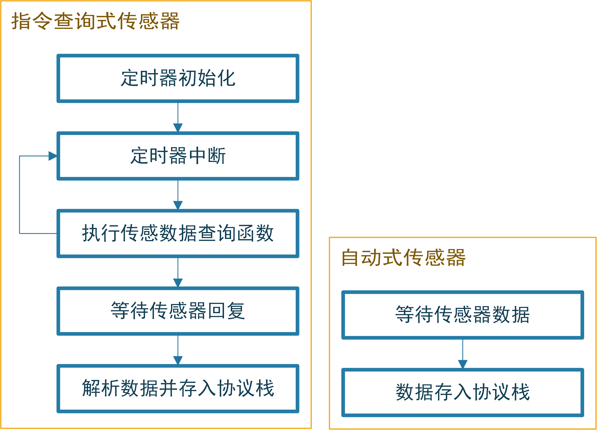{#fig:SensorProcess width=10cm}

#### 用户操作响应和异常数据指示

　　用户操作主要有按键操作、扫码器扫码操作和上位机操作3种方式。对于用户，其操作无外乎开关垃圾桶，因此，对于三种操作方式其操作捕捉方式有所不同，但是最终响应都是相同的。对于按键操作，本设计采用了一个硬件定时器捕捉下降沿的方式捕捉，采用定时器捕捉下降沿的好处是可以做到按键消抖[@Fu2018]，避免了抖动的按键输入信号对程序的影响；对于扫码操作，用户扫描的二维码信息会被存储到协议栈内部，等待上位机进行读取。上位机验证用户ID后向垃圾桶控制终端发送指令实现交互；用户在上位机上的操作被上位机解析为指令后通过协议发送到控制终端，所以扫码操作与上位机操作的控制方式是一致的。在最终的响应方面，如果用户请求开启垃圾桶，系统会查询垃圾桶内部的温度、可燃气体浓度、重量和桶满状态等判断垃圾桶是否适合开启，如果不适合开启将会忽略用户的操作。在获取状态信息时，也会把指标是否正常以指示灯的形式提醒给用户。用户操作响应和异常数据指示部分的算法流程如图{@fig:UserOperation}所示。

{#fig:UserOperation width=7cm}

## 小结

　　本章通过各个模块的硬件电路和软件的整体设计、模块设计，最终完成了整个控制系统的硬件电路设计以及电路板的制作实现。同时完成了控制软件的设计和开发，软件下载到制作的硬件电路板上工作正常，在与测试上位机通信时，未出现丢包误码等现象，稳定性较好。同时各路传感器数据均能正常采集，推杆也正常响应，可以顺利开关桶盖。本设计实现的智能垃圾桶控制终端以及外部传感器的安装实物如图{@fig:TrashBinFig}所示。图中(a)(b)分别是垃圾桶在关盖和开盖状态下的图像，图(b)中，编号为1的方框中是智能垃圾桶控制终端硬件电路、编号为2的方框中是嵌入式扫码器、编号为3的方框中是超声波传感器、编号为4的方框中是按键、编号为5的方框中从上到下依次是可燃气体传感器、桶满传感器和温湿度传感器。[^1]

[^1]:控制系统软件的详细文档和代码实现见附件

{#fig:TrashBinFig width=15cm height=9cm}

# 上位机交互系统设计与实现

## 上位机交互系统整体设计

　　上位机交互系统是垃圾桶控制终端与服务器之间的中继，同时也是用户查看垃圾桶信息以及操作垃圾桶的主要交互途径。本系统的交互系统设计为运行在Android操作系统上的程序，交互系统定时向其所连接的所有垃圾桶请求数据并在系统界面上可视化并上传服务器。当用户通过交互系统操作时，系统通过向垃圾桶控制系统发送指令响应用户的操作。不难看出，上位机与垃圾桶控制系统之间只有一个交互途径：MODBUS协议，因此，本设计中的上位机维护一个MODBUS消息队列，当系统需要向垃圾桶控制系统请求数据或发送指令控制时，就向消息队列中添加一个指令消息；同时，上位机的通信模块会定时从消息队列中取出消息进行发送。

　　用户交互方面，当用户扫码时，上位机系统会从垃圾桶分控系统中读取到用户的二维码ID，然后将此ID向服务器端查证。如果ID有效，则本次投递行为会被积分。

　　上位机交互系统的软件架构设计如图{@fig:UpmechineStructure}所示。

{#fig:UpmechineStructure width=10cm}

## 数据采集与可视化

　　数据采集模块是系统的根基，系统依赖该模块来实现垃圾桶状态数据的采集，几乎所有上层应用都需要该模块采集的信息。该模块基于谷歌的开源项目android-serialport-api所实现的Android串口通讯功能，结合3.2.8.2节表{@tbl:MODBUSInterfaceTbl}所述的通信接口设计实现垃圾桶控制系统的数据请求。串口通讯实例采用单独的service实现，降低与系统其他模块的耦合度，便于后期对系统的升级和维护。采集到的数据被存储到抽象的垃圾桶对象中，随后实时渲染在UI界面上。系统的UI界面设计如图{@fig:AndroidUIFig}所示。

{#fig:AndroidUIFig wigth=13cm height=14cm}

## 数据上传

　　采集到的数据暂存在系统内存中，考虑到垃圾桶终端遍布城市，数据量极大，以40分钟为周期向服务器通讯以上传数据包，数据包中包含的信息如表{@tbl:DataPackTbl}所示。

| 数据字段 | 字段含义           | 类型   |
| -------- | ------------------ | ------ |
| temp     | 桶内实时温度       | 数值   |
| humity   | 桶内实时湿度       | 数值   |
| gas      | 桶内可燃气体浓度   | 数值   |
| weight   | 垃圾桶内重量       | 数值   |
| isfull   | 垃圾桶是否已满     | 数值   |
| id       | 垃圾桶组唯一识别码 | 字符串 |
| position | 垃圾桶组位置       | 字符串 |
Table:上位机向服务器上传数据包字段表 {#tbl:DataPackTbl}

　　其中垃圾桶内部的温度、湿度、可燃性气体浓度等垃圾桶内部状态信息来自垃圾桶控制系统采集的数据，数据以对象数组形式上传，数组中每个数据项代表每个垃圾桶的状态，因此数组的长度实际上就是上位机所连接的分控系统数量；id信息为根据垃圾桶组的部署位置编码出的一个唯一识别码；位置信息来自于上位机的Android运行平台通过GPS定位系统采集到的位置信息，这个信息代表上位机所控制的所有垃圾桶的统一位置。

　　服务器无法做到主动向所有部署的垃圾桶设备请求数据，只能由垃圾桶的上位机主动向服务器推送数据。因此，上位机与服务器之间无法使用只能由客户端单端请求的HTTP协议[@HTTP]进行通信。本设计中，上位机通过WebSocket协议[@Li2021]向服务器推送数据，WebSocket协议是一种服务端和客户端双端平等的通讯协仪，十分适用本系统的信息推送需要。

## 用户交互

　　在上位机系统UI的首页上，用户可以点击每个垃圾桶下方的按钮进行垃圾桶盖的控制，也可以点击要控制的垃圾桶，在垃圾桶的详情页面控制垃圾桶。若垃圾桶内部状态不适宜开盖，则所有开盖按钮都不可点击，同时，UI上会出现对用户的提醒。

　　当用户通过垃圾桶上的扫码器扫描二维码后，上位机会采集到该二维码信息并向服务器发送一条包含该信息的报文，服务器收到该报文后会查询该二维码ID是否有效，并把结果返回给上位机。若用户登录有效，则UI上会显示该用户的ID和积分信息，同时，上位机系统开始记录当前垃圾桶内的垃圾重量$W_1$，当用户完成投递并关盖后，系统再次采集垃圾桶内垃圾重量$W_2$，则用户实际投递的垃圾重量为$W_2-W_1$，系统将根据此重量为用户计算积分。当用户开启垃圾桶盖后，系统开始关注垃圾桶前方的超声波测距数据。若超声波测距数据显示用户已不在垃圾桶前且超过一定时长，就会自动控制垃圾桶关闭。

　　用户与上位机交互的流程如图{@fig:HMIProcess}所示。

{#fig:HMIProcess width=10cm}

## 小结

　　本节通过上位机交互系统架构设计，结合垃圾桶控制系统的MODBUS协议栈设计和谷歌开源项目android-serialport-api实现了对与垃圾桶的MODBUS通信。在实现通信的基础上，通过设计消息队列中间层和数据采集以及垃圾桶控制模块，实现了对垃圾桶的状态采集和控制。最后集合获取的数据实现了数据的可视化/上传模块以及用户交互模块。该上位机模块相当于系统的物联网数据终端，其通过WebSocket协议可以实现对服务器的数据推送，为下文服务器系统的设计和实现打下了基础。[^2]

[^2]:上位机系统的具体实现见附录

# 服务器后端系统设计与实现

## 服务端整体架构

　　服务器后端系统收集并储存所有来自上位机系统推送的数据，基于服务端收集和存储的大量数据，可以驱动多种多样的应用系统。如城市垃圾桶管理系统等，这类据应用不仅使城市向数字化、智能化更进一步，还可以大大提高城市垃圾桶的管理水平。本设计提出的Android上位机系统收集垃圾桶数据并上传至服务器，则服务器端需要与之对接，实现数据的接收和持久化；同时，对于上位机的请求（如用户ID验证请求），服务端系统也需要及时响应。由于部署的垃圾桶设备遍布城市，数量较大，因此服务端系统需要使用负载均衡等多种技术缓解服务器压力，实现与客户端稳定的通信。服务端系统的架构如图{@fig:ServerStructure}所示。

{#fig:ServerStructure width=11cm}

　　如图中所示，用户和上位机的请求基本可分为两种类型：用户访问数据应用产生的HTTP请求和上位机系统向服务器推送数据而产生的WebSocket请求。向服务器发出的请求经过负载均衡层分别交由HTTP服务器和WebSocket服务器进行处理并响应。在处理过程中，使用Redis缓存服务器对高并发、大量数据IO的情形进行优化。同时数据以一定的频率存储到对象数据库服务器中。

## 服务器接口设计

　　根据系统整体架构设计，垃圾桶上位机终端采集到的数据通过HTTP请求上传到服务端，系统数据上传的Socket连接接口为：wss://site.maple.today/RubbishSeparator/InteractSocket_separator/{Id}/{latitude}/{longitude}，其中{Id}为终端唯一标识符，{latitude}为终端所在位置的维度信息，{longitude}为经度信息。完成Socket连接后，垃圾桶上位机可以进行垃圾桶数据包的上传，数据包报文格式如表{@tbl:UploadInterface}所示。

| 第一组 | 第二组  | 第三组  | 第四组  | 第五组  | ... |
| ------ | ------- | ------- | ------- | ------- | --- |
| 功能码 | 数据包1 | 数据包2 | 数据包3 | 数据包4 | ... |
Table:垃圾桶上位机与服务端数据传输报文格式 {#tbl:UploadInterface}

　　根据功能码的不同，数据包的含义也不同，具体关系如表{@tbl:CodeToDatapackTbl}所示。

| 功能码 | 功能           | 数据包1       | 数据包2        | 数据包3       | 数据包4       | ... |
| ------ | -------------- | ------------- | -------------- | ------------- | ------------- | --- |
| 1001   | 心跳检测       | -             | -              | -             | -             | -   |
| 1002   | 垃圾桶数据上传 | 1号垃圾桶状态 | 2号垃圾桶状态  | 3号垃圾桶状态 | 4号垃圾桶状态 | ... |
| 1003   | 上传用户积分   | 用户ID        | 用户获取的积分 | -             | -             | -   |
| 1004   | 用户登录       | 用户ID        | -              | -             | -             | -   |
Table:功能码与数据包含义对照表 {#tbl:CodeToDatapackTbl}

　　其中，垃圾桶状态数据数据包中的数据为线性排列，其结构如表{@tbl:TrashcanDataStructure}所示。

| 第一位   | 第二位   | 第三位           | 第四位   | 第五位       |
| -------- | -------- | ---------------- | -------- | ------------ |
| 温度数据 | 湿度数据 | 可燃气体浓度数据 | 重量数据 | 桶满状态数据 |
Table:垃圾桶状态数据包格式 {#tbl:TrashcanDataStructure}

　　本服务器系统所收集的数据可以驱动多种多样的数据应用，因此，服务器系统也为其他应用的开发预留了数据请求的接口。本系统中垃圾桶数据请求接口为：https://site.maple.today/RubbishSeparator/MainMobile。,通过此接口可以获取指定一个或多个垃圾桶的数据信息。[^3]

[^3]: 系统接口详细文档见附录

## 用户登录和积分模块设计

　　用户信息预先注册在数据库中，当用户通过交互系统登录时，上位机交互系统会将用户ID信息发送至服务端进行验证。服务端系统处理该信息并返回验证结果。

　　当用户通过垃圾分类投递产生积分时，上位机交互系统会将用户ID和计算好的积分数据打包发送到服务端。服务端系统会处理这个数据包并在服务端更新用户积分，同时将用户ID和更新后的积分打包返回给上位机交互系统。用户登录和积分模块的服务端处理流程大致如图{@fig:UserScoreProcess}所示。

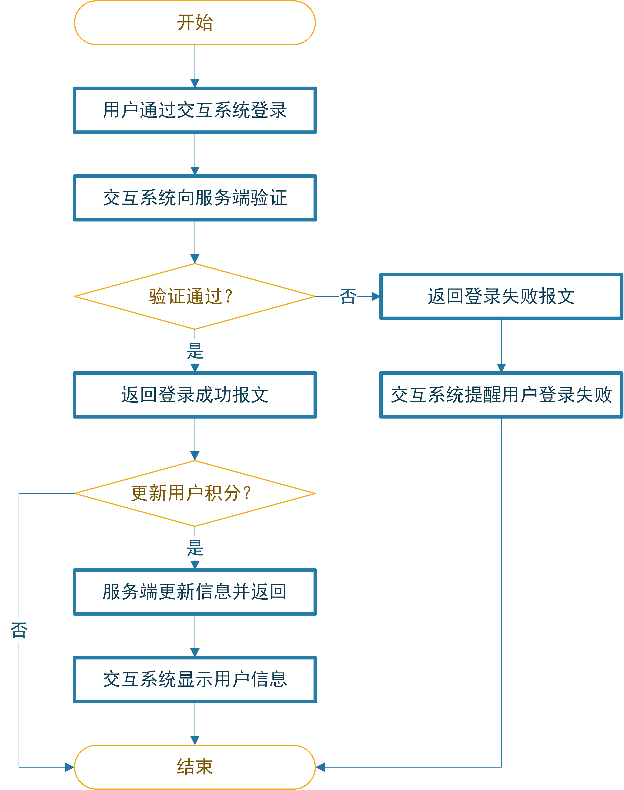{#fig:UserScoreProcess width=10cm}

## 服务器后端系统实现

　　目前的服务器主要分为物理主机服务器和云服务器。物理主机服务器指实际的服务器硬件系统，一般部署在服务器机房的机架上，物理服务器主机稳定性高、性能和可控性好，但是缺点是价格昂贵、维护困难。云服务器则因其无需机房、启动成本低、方便易用的优点称为目前中小型服务端系统的首选，因此本系统的服务器选择云服务器作为软件系统的宿主。在国内的云服务器市场中，阿里云因布局较早，服务较优现已是国内最大的公共云计算服务提供商，本系统所使用的云服务器也来自阿里云。

　　服务器后端系统主要基于JavaWeb技术和Tomcat容器[@Yang2021a]，使用Spring Boot框架[@Wang2016]开发而成，主要实现对用户请求、智能垃圾桶上位机终端请求的监听和处理以及数据持久化功能，对于IO密集的数据库读写操作，本系统还使用了Redis缓存技术[@Fang]实现性能优化，提高了系统的数据吞吐能力。

## 智慧城市垃圾桶信息化平台

　　基于智能垃圾桶终端上传的信息和服务端系统对信息的接收和托管，可以实现城市垃圾桶的信息化管理。服务端系统中的数据实际上可以用于实现很多不同维度的应用，本文抛砖引玉式地设计一套智慧城市垃圾桶信息化平台，实现监控城市智能垃圾桶状态的信息化大屏，希望为其他应用的开发起到一点参考和启发。

　　本设计采用来自Apache的开源图表项目ECharts[@Li2018]，ECharts是一个JavaScript语言开发的可视化图表库，可以运行在任何支持浏览器功能的设备中。ECharts提供多种可视化图表类型，并且支持千万级别的前端数据的渲染。同时它支持多种交互动效以及多种维度的数据支持，是一个十分适合用于数据可视化领域的图表组件库。

　　本设计中实现的垃圾桶信息化平台可从各区设备在线数、各区设备离线数、各区垃圾桶桶满情况、各区垃圾桶告警情况以及历史垃圾桶上线下线和历史垃圾桶告警情况等多个维度进行监控。系统的设计UI如图{@fig:web}所示。

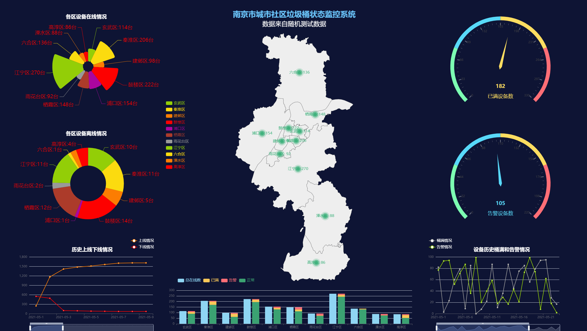{#fig:web width=16cm}

　　由于本设计实现的系统实际并未大规模部署，图中所示的数据来自后台随机生成的测试数据，仅用于体现系统效果。但是该可视化系统面向实际开发，向服务器请求数据以及数据处理的接口设计与实际情况别无二致，可以做到对真实数据的处理和监控。

## 小结

　　本章在垃圾桶控制终端的软硬件实现和上位机系统实现的基础上对系统服务器后端软件进行了设计和开发，进行了服务端架构设计、接口设计和用户登录和积分流程设计。随后基于系统需求和物理主机、云服务器的特点进行了服务器选型，为服务端程序的开发实现奠定了基础。最后基于JavaWeb技术、Tomcat容器、Spring Boot框架等对服务端软件进行了开发和实现。服务端系统的设计和实现为数据应用的设计打下了基础，实现了系统数据的云端同步，真正做到了智能垃圾桶系统的信息化管理。[^4]

[^4]:服务端系统的具体代码实现见附录

# 总结与展望

## 总结

　　自新世纪以来，我国的经济社会都迎来了飞速发展，国家的城市化进程和建设水平也在不断提高。城市居民生活水平提高的同时，日常消费也变得多姿多彩。但是与消费水平共同提高的还有生活垃圾的产生速度，为了解决生活垃圾的大量产生带来的垃圾处理速度不足的问题，我国以及国际各发达国家纷纷采取垃圾分类回收政策来提高垃圾的回收处理效率和资源利用率。

　　城市社区垃圾桶作为居民生活垃圾的集中地和回收点，一直在城市生活垃圾回收中起着重要作用。当前，物联网、云计算等信息化技术的飞速发展和传感器、自动控制领域的成熟经验推动了城市智能垃圾桶的发展。为了实现对城市社区垃圾桶的统一管理和状态监控，本文设计并实现了一种用于城市社区垃圾回收点的物联网智能垃圾桶系统，实现了对城市社区垃圾桶的数字化管理。本文的主要研究内容总结如下：

#### 对城市智能垃圾桶的研究现状进行了调查研究，详细考察交接了目前国内外相关产品和设计和使用情况，结合实际部署场景，对系统的功能和架构进行设计。

#### 结合传感器和嵌入式技术对系统的数据采集和控制终端进行硬件电路和软件系统的设计和开发，并对系统电路板和嵌入式控制软件进行测试，证明设计的可用性。

#### 通过Android上位机软件的设计和开发实现用户交互，垃圾桶状态数据采集和上传以及用户积分激励功能，实现了系统的物联网终端，为服务器端系统的设计和开发打下基础。

#### 结合云计算、数据库等技术，实现了系统的服务端部分，实现了分布式终端数据的采集存储和统一管理。同时设计了垃圾桶数据请求接口，为上层数据应用系统的设计打下基础。结合接口设计，本文还设计实现了一个简单的智慧城市垃圾桶信息化平台，利用服务端数据对城市垃圾桶分布做可视化处理。

## 展望

　　本文结合使用传感器、嵌入式技术、物联网、Android软件开发、服务器、数据库和数据可视化技术设计开发了智慧城市物联网智能垃圾桶系统，系统采集的垃圾桶状态数据可以实现城市垃圾桶的数字化管理，用户信息以及积分系统则可以对垃圾分类行为进行激励，提升居民的垃圾分类意识和积极性，为城市生活垃圾分类助力。就系统功能设计来看，本设计提出的系统确实解决了一些问题，但是系统的部分细节功能设计还过于粗放和简单，还有一些值得深入研究的空间，如在服务端系统方面，系统采集到的数据仅仅进行了简单的归类和存储，可以结合大数据、人工智能技术对数据进行进一步的分析，提取出更具价值的信息。如，可以对某地各时间段用户垃圾投递量进行分析，为管理人员规划出最佳的垃圾回收时间；还可以结合地理位置信息进行分析，为管理单位规划出最优的垃圾桶部署地图。在数据应用层面，本系统预留了数据请求的接口，在实现上仅仅实现了一个简单的数据可视化系统，可以利用该接口请求数据设计更多维度的数据分析或用户指导系统。如，可以结合GPS定位技术为用户推荐出距离最近的可投递的垃圾桶并且规划路线；还可以结合温度传感器的数据计算一个地区的温度分布等。
# 致谢

行文至此，意味着我的大学生涯已经到达了终点。在这四年的大学学习期间，我得到了很多老师、同学和朋友的关怀和帮助。在学位论文即将完成之际，我要向所有在我大学期间给与我支持、帮助与鼓励的人们表示我最诚挚的谢意。

首先我要感谢我的指导老师董大兴老师和赵蕴龙老师对我的指导，从毕设的选题和研究阶段到毕业论文的整理撰写以及定稿阶段，老师都给了我悉心的指导和热情的帮助，使我的毕业设计和论文能够顺利的完成。老师对工作的认真负责、对学术的钻研精神和严谨的态度都值得我终生学习。

其次，感谢理学院全体老师，由于他们的悉心教导，我学到了扎实的专业知识，掌握了扎实的专业技能。同时，理学院对学生科创的大力支持让我能够在本科期间参与多个项目，从中学习了计算机编程技能和基础知识，为我的毕业设计打下基础。

最后，感谢我的家人二十余年来给予我的关心和支持，正是由于他们的支持和照顾，我才能安心完成我的学业。同时也十分感谢我的同窗同学以及舍友，四年来，他们与我朝夕相处，在生活上互帮互助，共同走过了这四年精彩的求学生涯。